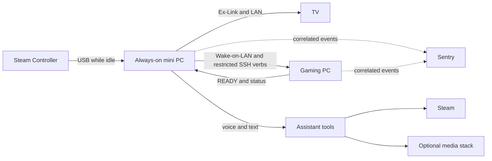

# Slopstation

[](https://github.com/trillville/slopstation/actions/workflows/ci.yml)
[](https://github.com/trillville/slopstation/actions/workflows/cd.yml)

Slopstation turns a Windows gaming PC, a Samsung TV, and a Steam Controller
into a couch console. An always-on mini PC controls the TV and gaming PC,
accepts controller, voice, and text commands, and tracks long-running Steam and
media work.

One controller chord starts a session. Slopstation powers on the TV, wakes the
gaming PC, applies its TV display profile, claims the remote controller over
USB, opens Steam Big Picture, and changes the TV input only after the gaming PC
reports that it is ready. Ending the session restores the desk display and
returns the controller to the mini PC.

## Architecture



The two machines divide responsibility deliberately. The mini PC owns intent,
TV control, and session state. The gaming PC owns interactive Windows work
through scheduled tasks. SSH can invoke only the verbs accepted by
`gaming-pc/Dispatch.ps1`; it never runs arbitrary remote commands.

## Engineering highlights

- **Failure-aware orchestration.** A launch does not take over the TV until the
  gaming PC reports ready. Failed launches restore any state they changed.
- **Safe deployment.** Deployments wait while someone is using the couch setup,
  fail instead of interrupting the session, and never roll back over live state.
- **Cross-machine correlation.** One short turn identifier follows a request
  through the controller or voice entry point, the mini PC, the gaming PC, and
  retained telemetry.
- **Durable operations.** Steam installs and media requests continue after the
  conversation that started them and can report progress later.

## Evaluate the project

The fastest code-reading path is:

1. `src/slopstation/couch.py` for the session state machine.
2. `gaming-pc/Dispatch.ps1` for the constrained remote surface.
3. `gaming-pc/Enter-TV.ps1` and `Exit-TV.ps1` for the interactive half.
4. `src/slopstation/agent/dispatch.py` and `agent/tools/operations.py` for
   commands and durable work.
5. `src/slopstation/events.py` for the event contract shared by both machines.

The test suite exercises the Python components and parses the PowerShell
scripts. Hardware-dependent tests skip unless the matching device is present.

## Requirements

The reference deployment uses:

- an always-on Windows mini PC with Python 3.13;
- a Windows gaming PC with Steam, Windows OpenSSH Server, DisplayMagician, and
  VirtualHere Client;
- a Samsung TV with Ex-Link control and a dedicated PC input; and
- a Steam Controller whose USB receiver is attached to the mini PC.

Equivalent hardware may work, but the current implementation intentionally
does not claim generic TV or controller support.

## Install the mini PC

1. Clone the repository to a stable path such as `C:\slopstation`.
2. Copy `config.example.json` to `config.json` and `secrets.example.json` to
   `secrets.json`. Replace every documentation address and add the credentials
   for the features you enable. Both live files are ignored by Git.
3. Create the environment and install the package:

   ```powershell
   python -m venv .venv
   .venv\Scripts\pip install -e ".[dev]" -c constraints.txt
   ```

4. Install VirtualHere Server. Reserve the mini PC's address in DHCP and allow
   TCP port 7575 from the private LAN.
5. Connect the TV's Ex-Link adapter and set its COM port in `config.json`.
6. Register the controller and voice tasks from a non-administrator PowerShell
   window:

   ```powershell
   .\Setup-K15-Tasks.ps1
   .\Start-Slopstation.bat
   ```

7. If volume ducking is enabled, pair the TV remote:

   ```powershell
   .venv\Scripts\python -m slopstation.agent.tools.tv_remote pair
   ```

8. Run `.venv\Scripts\slopstation-doctor` until no checks fail.

### Optional remote assistant access

The Model Context Protocol (MCP) endpoint forwards requests to the existing
authenticated text interface. Keep it on localhost behind an authenticated
tunnel; do not expose the local media services directly to the internet.

1. Set `textInterfaceToken` and `remoteInterfaceToken` in `secrets.json`.
2. Enable `textInterface` and `remoteInterface` in `config.json`.
3. Route an authenticated tunnel to `http://127.0.0.1:8766`.
4. Restart Slopstation and run the doctor.

## Install the gaming PC

1. Install Steam, DisplayMagician, VirtualHere Client, and Windows OpenSSH
   Server.
2. Create working `OFFICE.lnk` and `TV-GAMING.lnk` DisplayMagician profiles in
   `C:\CouchGaming`.
3. Configure the seven `\CouchGaming\` scheduled tasks and restrict the mini
   PC's SSH key to `Dispatch.ps1` in
   `C:\ProgramData\ssh\administrators_authorized_keys`.
4. Deploy from a repository checkout:

   ```powershell
   powershell -NoProfile -ExecutionPolicy Bypass -File .\gaming-pc\Deploy.ps1
   ```

5. Run the deployed doctor:

   ```powershell
   powershell -NoProfile -ExecutionPolicy Bypass -File C:\CouchGaming\Doctor.ps1
   ```

The reproducible gaming-PC installer is the next change in the publication
series. Until then, these tasks remain the only underspecified setup step.

For Radarr, Sonarr, and qBittorrent setup, see the co-located
[media guide](media/README.md).

## Configuration

`config.json` contains device names, addresses, and feature settings.
`secrets.json` contains credentials and authentication tokens. Both live files
remain at the repository root because the runtime, doctor, and deployment path
already agree on that contract. `SLOPSTATION_HOME` relocates configuration,
state, and logs together when the checkout is not the runtime home.

The example uses IANA documentation addresses and a locally administered MAC
address. They are not usable deployment values.

The default wake word is an upstream openWakeWord model downloaded into the
virtual environment. Custom `.onnx` and verifier files are local operator
artifacts under `src/slopstation/agent/models/`; recordings and custom models
are not distributed by this repository.

## Deployment

Continuous deployment runs only after continuous integration succeeds for a
push to `main`. Pull-request code never reaches either self-hosted runner. The
mini PC updates its live checkout; the gaming PC copies a checked script set to
`C:\CouchGaming`. Both paths wait for an active couch session to finish.

Register the runners with the labels `k15` and `gamepc`. Set the repository
variable `K15_CHECKOUT` when the mini PC checkout is not `C:\slopstation`.

## Telemetry

Structured events are written to `logs\k15-YYYYMMDD.jsonl` on the mini PC and
`C:\CouchGaming\logs` on the gaming PC. The example OpenTelemetry Collector
configurations ship those logs to Sentry. Telemetry is optional and never lies
on the session's control path.

## Repository layout

| Path | Purpose |
|---|---|
| `src/slopstation/` | Session orchestration, device access, interfaces, and assistant tools |
| `gaming-pc/` | Interactive scripts and the restricted SSH dispatcher |
| `media/` | Optional media stack and its setup guide |
| `tests/` | Python behavior tests and PowerShell contract checks |
| `.github/workflows/` | Hosted checks and guarded self-hosted deployment |

## Development

Run the same checks as continuous integration:

```powershell
.venv\Scripts\pytest
.venv\Scripts\ruff check .
.venv\Scripts\mypy
```

Tests that require Steam or real audio devices skip when those devices are not
available.

## License

Slopstation is licensed under the [MIT License](LICENSE).
