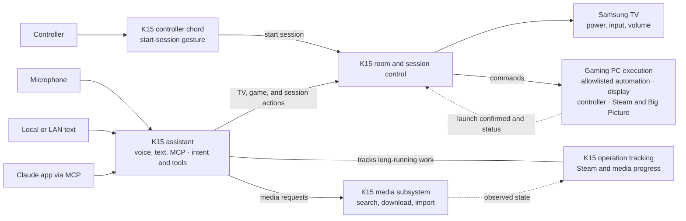
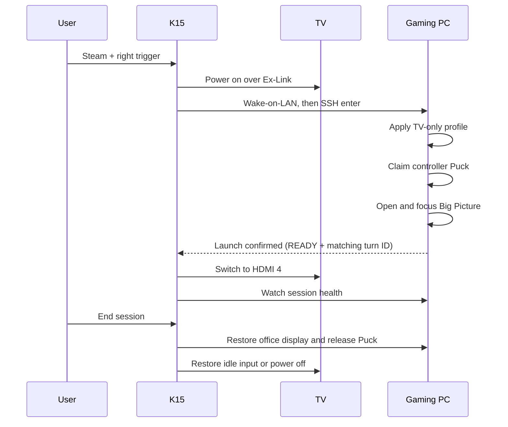

# slopstation

[](https://github.com/trillville/slopstation/actions/workflows/ci.yml)
[](https://github.com/trillville/slopstation/actions/workflows/cd.yml)

Slopstation turns a Windows gaming PC, a Samsung S90C, and a Steam Controller
into a couch console. A GMKtec K15 mini PC owns orchestration: it can start a
session from a controller chord, accept voice, text, and MCP requests, and
track long-running Steam and media work across restarts.

Hold **Steam + right trigger** for two seconds, or say **“hey jarvis, play
Armored Core Six.”**

## Architecture



The system has three operating constraints:

- **Nothing switches the TV to HDMI 4 until the gaming PC confirms a successful
  launch.** That acknowledgement is named `READY` in the protocol. A failed
  launch leaves the viewer’s current input unchanged.
- **The chord lane is independent of voice.** Core K15 modules use system
  Python and the standard library; the voice overlay has its own virtual
  environment and may fail without taking down controller launch.
- **External systems own long-running work.** Steam, Radarr, and Sonarr execute
  operations. Slopstation records correlation and progress, then resumes
  observation after a restart.

## Couch session lifecycle



`couch.py` owns the launch lock and watch loop. The gaming PC performs display,
USB, and Steam mutations through scheduled tasks. Teardown wins over launch;
launch waits for an active teardown and aborts if it cannot obtain a clean
starting state.

## Voice, text, MCP, and tools

The voice overlay listens locally for the wake word, streams speech to
Deepgram, and sends each final transcript through two paths:

1. `grammar_gate.py` handles deterministic room and gaming commands.
2. `assistant.py` handles open-ended requests through typed tools.

Shared room and gaming actions use `dispatch.py`; assistant tools add Steam and
media integrations. The authenticated text client, `k15/slop.py`, reaches the
same assistant and tools through `text_interface.py`.

`remote_interface.py` is a small MCP adapter for a Claude custom connector. It
exposes one tool, `ask_slopstation`, and forwards each call to the text
interface over localhost. It owns no assistant state or separate action
surface. Voice, text, and MCP therefore share media resolution, Steam actions,
deletion guards, operation status, and turn correlation.

Long-running work is stored in `k15/state/operations.json`. Each record names
the originating turn, authority, external resource, state, progress, and
announcement status. Background monitors reconcile active records every 30
seconds. An unreachable authority becomes `UNKNOWN`, not failed. Terminal
results remain pending until spoken or retrieved through the assistant.

See [the media runbook](k15/media/README.md) for the Radarr/Sonarr pipeline.

## Runtime layout

| Area | Host | Runtime | Update path |
|---|---|---|---|
| `k15/` | `K15` | Repository clone on the Desktop | The `cd` workflow, or `git pull` then `Start-K15.bat` |
| `gaming-pc/` | `TILLMAN-DESKTOP` | `C:\CouchGaming` | The `cd` workflow, or `gaming-pc\Deploy.ps1` from a PC checkout |
| `wake-training/` | Gaming PC | Checkout plus external training data | Run in place; GPU required |

The gaming PC is deployed by copy because its runtime also contains
machine-generated DisplayMagician shortcuts and the VirtualHere client.
`Deploy.ps1` copies one checked script set and stamps `build-id`; K15 doctor
compares that stamp with its own checkout to detect skew.

The forced SSH surface is intentionally small: `enter`, `exit`, `status`,
`enterstate`, `version`, `games`, `playing`, `collections`, `launch`, `stop`,
and constrained `nav` targets. Mutating verbs also accept a `--turn <hex>`
correlation suffix; every other command returns `DENIED`.

### Repository map

| Path | Responsibility |
|---|---|
| `k15/couch.py`, `chord_listener.py` | Session orchestration and controller input |
| `k15/tv.py`, `haptics.py`, `gamepc.py` | Hardware and gaming-PC boundaries |
| `k15/events.py`, `cglib.py`, `doctor.py` | State, telemetry, configuration, and diagnostics |
| `k15/voice/` | Wake word, speech pipeline, assistant tools, durable operations, and text/MCP interfaces |
| `k15/media/` | Docker Compose media services and their runbook |
| `gaming-pc/` | Forced SSH dispatcher and scheduled-task implementations |
| `wake-training/` | Wake-word training and evaluation |

## Bootstrap

### K15

1. Clone the repository to `C:\Users\minipc\Desktop\slopstation` and ensure
   Python is on `PATH`.
2. Copy `k15\config.example.json` to `k15\config.json` and
   `k15\secrets.template.json` to `k15\secrets.json`. Set device names,
   addresses, API keys, and local tokens; both destination files are ignored by
   Git. `tvIp` enables TV-state evidence and is required for volume ducking.
3. Install the VirtualHere server and give the K15 a DHCP reservation. Allow
   its USB hub from the private LAN:

   ```powershell
   New-NetFirewallRule -DisplayName 'VirtualHere USB hub (LAN)' -Direction Inbound -Action Allow -Protocol TCP -LocalPort 7575 -Profile Private -RemoteAddress LocalSubnet
   ```

   `doctor.py` verifies the service, listener, and firewall rule. Zero connected
   clients is normal while the gaming PC sleeps.
4. Connect the TV’s Ex-Link adapter. The configured COM port must identify the
   Ex-Link device.
5. Run `k15\Start-K15.bat`. The first voice start creates its virtual
   environment and installs the pinned dependencies.
6. Put a shortcut to `Start-K15.bat` in `shell:startup`.
7. If TV volume ducking is enabled, run
   `.venv\Scripts\python tv_remote.py pair` from `k15\voice` and accept the TV
   prompt.
8. Run `python doctor.py` from `k15` until no checks fail.

#### Optional MCP access

MCP adds remote access to the existing assistant; it does not create another
assistant or tool implementation. The request path is:

```text
Claude app → Cloudflare tunnel → remote_interface.py → text_interface.py → assistant tools
```

1. Set real `textInterfaceToken` and `remoteInterfaceToken` values in
   `k15\secrets.json`; each should contain at least 32 random bytes.
2. Enable both `textInterface` and `remoteInterface` in `k15\config.json`.
   Keep the remote interface on `127.0.0.1:8766`. The text interface may also
   remain on localhost unless another LAN client needs it.
3. Route a Cloudflare named tunnel to `http://127.0.0.1:8766`, install
   `cloudflared` as a Windows service, and restrict the public hostname to
   Anthropic’s documented connector egress range (currently
   `160.79.104.0/21`).
4. Add a Claude custom connector at `https://<host>/mcp` using
   `Authorization: Bearer <remoteInterfaceToken>`.
5. Reload with `Start-K15.bat`, then run `python doctor.py`. The voice agent
   hosts both local interfaces automatically when they are enabled.

The outer token authenticates the connector and never reaches the assistant;
`textInterfaceToken` stays on the K15. The MCP adapter holds no conversation
state, so its tool passes a session ID explicitly and asks the connector to
make each request self-contained.

### Gaming PC

1. Install Steam, DisplayMagician, VirtualHere Client, and Windows OpenSSH
   Server. Create working `OFFICE.lnk` and `TV-GAMING.lnk` DisplayMagician
   profiles.
2. Configure the `CouchGaming` scheduled tasks and the forced SSH command in
   `C:\ProgramData\ssh\administrators_authorized_keys`. The exposed command
   surface is the allowlist in `Dispatch.ps1`.
3. From a repository checkout on the PC, run:

   ```powershell
   powershell -NoProfile -ExecutionPolicy Bypass -File .\gaming-pc\Deploy.ps1
   ```

4. Run the deployed doctor until no checks fail:

   ```powershell
   powershell -NoProfile -ExecutionPolicy Bypass -File C:\CouchGaming\Doctor.ps1
   ```

Media acquisition is optional and has a separate ordered bootstrap in
[`k15/media/README.md`](k15/media/README.md).

## Continuous deployment

A green `ci` run on `main` triggers `cd`, which deploys each machine and runs
its doctor. Neither machine accepts inbound connections, so each runs a
self-hosted GitHub Actions runner that polls outbound.

The two legs are independent. The gaming PC sleeps, so its runner is offline
most of the time and its job waits in the queue - GitHub cancels one nothing
claims within about a day - while the K15 deploys immediately. Until the PC
catches up on its own next wake, `doctor.py` reports the skew as a WARN.

Both legs park rather than interrupt a session. The PC waits while its READY
marker exists or an Enter/Exit task is running; the K15 waits while the session
lock is fresh. The budget is `WAIT_MINUTES` in `.github/workflows/cd.yml`; past
it the run fails and the next green commit retries. A failing doctor fails the
run and changes nothing else - there is no automatic rollback.

This repository is public and the runners are self-hosted, so `cd` runs only
for a `push` that reached `main`. A fork's pull request runs `ci` here too, and
its head branch can be called anything, so the branch filter alone would not
keep a stranger's commit off the gaming PC.

Runner setup, once per machine:

1. Add a repository runner (Settings, Actions, Runners) labelled `gamepc` on
   `TILLMAN-DESKTOP` and `k15` on the K15. The PC also needs `git` on `PATH`:
   without it the checkout arrives as a plain tarball and `Deploy.ps1` stamps
   `nogit` instead of a rev, which is the one thing the skew check reads.
2. Run it interactively - `run.cmd` with a shortcut in `shell:startup` - not as
   a service. The K15's lanes must relaunch inside the logged-in session or
   they reach neither the Puck nor the audio devices, and the PC's doctor reads
   display state that session 0 does not have.
3. On the K15 the runner never checks the repository out: it runs
   `k15\deploy.py` from the live checkout, which must already be on `main`,
   clean, and current. Set the repository variable `K15_CHECKOUT` if that
   checkout is not at `C:\Users\minipc\Desktop\slopstation`.

`deploy.py` fast-forwards the checkout, kills each running agent so its
supervisor relaunches it on the new code, then runs `doctor.py`. It never
starts a lane: an agent that does not come back is reported, not restarted. The
chord lane must be running when it finishes - `doctor.py` only WARNs about a
dead one, so without that check a deploy onto a K15 with no supervisors would
report success.

## Operate and diagnose

After updating the K15 checkout:

```powershell
git pull
cd k15
.\Start-K15.bat
python doctor.py
```

`Start-K15.bat` starts missing supervisors or reloads only their child agents.
It does not replace an active couch-session watch loop, and it does not start
the optional media Compose stack. Docker Desktop restores those containers
independently after their initial setup.

Useful commands:

```powershell
# General text interface
python k15\slop.py
python k15\slop.py "what is downloading?"

# Durable Steam and media work
cd k15\voice
.venv\Scripts\python operations.py list
.venv\Scripts\python operations.py list --active
.venv\Scripts\python operations.py show <operation-id>
.venv\Scripts\python operations.py reconcile
```

`operations.py abandon <operation-id> --execute` performs authoritative media
cleanup through Radarr or Sonarr. The generic `cancel` command refuses work it
cannot safely cancel at the external authority.

The text endpoint requires `textInterfaceToken`. Bind it to `0.0.0.0` only for
LAN access, allow its port on the Windows **Private** profile for `LocalSubnet`,
and provide `SLOPSTATION_URL` and `SLOPSTATION_TOKEN` on LAN clients. MCP needs
no inbound firewall rule: its server stays on localhost behind the tunnel.

## Telemetry

Every intent carries a `turn` ID through K15 and gaming-PC events. Local JSONL
is the source of truth:

- K15: `k15\logs\k15-YYYYMMDD.jsonl`
- Gaming PC tasks: `C:\CouchGaming\logs\pc-YYYYMMDD.jsonl`
- Forced SSH dispatcher: `C:\CouchGaming\logs\pc-dispatch-YYYYMMDD.jsonl`

Grafana Alloy mirrors these files to Loki; Langfuse holds assistant traces.
Use the repository’s Grafana and Langfuse skills for remote diagnosis.

## Tests

Run the blind suite as scripts, not through pytest:

```powershell
cd k15\voice
.venv\Scripts\python tests\run.py
```

Hardware-bound Steam and audio tests skip when their devices are absent;
`--all` forces them. GitHub Actions runs the blind suite and mypy on Windows for
every pull request and every push to `main`.

## Fixed rig contract

| Component | Current value |
|---|---|
| Gaming PC | `TILLMAN-DESKTOP`, `192.168.68.67`, user `tillm` |
| K15 | `K15`, `192.168.68.75`, user `minipc` |
| TV | Samsung S90C, HDMI 4 for PC, Ex-Link on K15 `COM3` |
| Controller Puck | VirtualHere device `Steam Controller Puck`, resolved by name because its address can change; VID `28DE`, PID `1304` |
| Audio | HW-Q990C over eARC; volume writes use TV WebSocket remote keys |
| TV-primary probe | Primary display height equals `2160` |

Revisit the display probe before adding another 2160-pixel-high desk display.
The TV acknowledges unsupported Ex-Link volume commands but does not apply
them; `tv_remote.py` is the working volume path.

Runtime-only state is intentionally absent from Git: real config, secrets, the
media `.env`, VirtualHere binaries and PINs, DisplayMagician shortcuts,
scheduled-task registrations, SSH/firewall state, logs, operation state, voice
virtual environment, and wake-training data.
