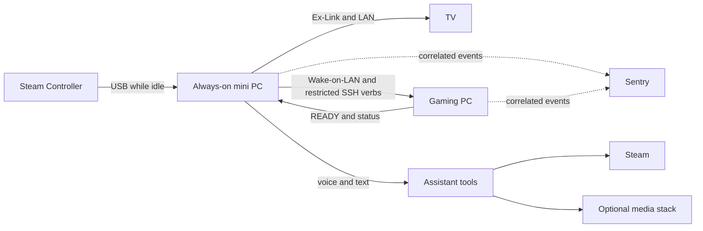

# Slopstation

[](https://github.com/trillville/slopstation/actions/workflows/ci.yml)
[](https://github.com/trillville/slopstation/actions/workflows/cd.yml)

Slopstation turns a Windows gaming PC, a Samsung TV, and a Steam Controller
into a couch console. An always-on mini PC controls the TV and gaming PC,
accepts controller, voice, and text commands, and tracks long-running Steam and
media work.

One controller chord starts a session. Slopstation powers on the TV, wakes the
gaming PC, applies its TV display profile, claims the remote controller over
USB, opens Steam Big Picture, and changes the TV input only after the gaming PC
reports that it is ready. Ending the session restores the desk display and
returns the controller to the mini PC.

## Architecture



The two machines divide responsibility deliberately. The mini PC owns intent,
TV control, and session state. The gaming PC owns interactive Windows work
through scheduled tasks. SSH can invoke only the verbs accepted by
`gaming-pc/Dispatch.ps1`; it never runs arbitrary remote commands.

## Engineering highlights

- **Failure-aware orchestration.** A launch does not take over the TV until the
  gaming PC reports ready. Failed launches restore any state they changed.
- **Safe deployment.** Deployments wait while someone is using the couch setup,
  fail instead of interrupting the session, and never roll back over live state.
- **Cross-machine correlation.** One short turn identifier follows a request
  through the controller or voice entry point, the mini PC, the gaming PC, and
  retained telemetry.
- **Durable operations.** Steam installs and media requests continue after the
  conversation that started them and can report progress later.

## Evaluate the project

The fastest code-reading path is:

1. `src/slopstation/couch.py` for the session state machine.
2. `gaming-pc/Dispatch.ps1` for the constrained remote surface.
3. `gaming-pc/Enter-TV.ps1` and `Exit-TV.ps1` for the interactive half.
4. `src/slopstation/agent/dispatch.py` and `agent/tools/operations.py` for
   commands and durable work.
5. `src/slopstation/events.py` for the event contract shared by both machines.

The test suite exercises the Python components and parses the PowerShell
scripts. Hardware-dependent tests skip unless the matching device is present.

## Requirements

The reference deployment uses:

- an always-on Windows mini PC with Python 3.13;
- a Windows gaming PC with Steam, Windows OpenSSH Server, DisplayMagician, and
  VirtualHere Client;
- a Samsung TV with Ex-Link control and a dedicated PC input; and
- a Steam Controller whose USB receiver is attached to the mini PC.

Equivalent hardware may work, but the current implementation intentionally
does not claim generic TV or controller support.

## Install

Start with the [setup guide](docs/setup.md). It covers both Windows machines,
the restricted automation key, scheduled tasks, health checks, and the
hardware acceptance test.

The first-run outline is:

1. Install the mini-PC prerequisites, create a Python 3.13 environment, and
   copy the example configuration and secrets files.
2. Install and test Steam, DisplayMagician, VirtualHere Client, and OpenSSH on
   the gaming PC.
3. Run `gaming-pc\Install.ps1` from an administrator PowerShell, fill the four
   machine-specific values it creates, and run it again.
4. Run both doctors and exercise one complete enter-and-exit session.

For the optional Radarr, Sonarr, Prowlarr, and qBittorrent stack, follow the
co-located [media guide](media/README.md).

## Documentation

- [Setup](docs/setup.md) installs and validates both machines.
- [Configuration](docs/configuration.md) describes settings, secrets, and
  environment variables.
- [Operations](docs/operations.md) covers deployment, diagnosis, recovery,
  state, logs, and the public-release gate.
- [Design decisions](docs/decisions.md) records the boundaries behind the
  architecture.

## Repository layout

| Path | Purpose |
|---|---|
| `src/slopstation/` | Session orchestration, device access, interfaces, and assistant tools |
| `gaming-pc/` | Interactive scripts and the restricted SSH dispatcher |
| `media/` | Optional media stack and its setup guide |
| `tests/` | Python behavior tests and PowerShell contract checks |
| `.github/workflows/` | Hosted checks and guarded self-hosted deployment |

## Development

Run the same checks as continuous integration:

```powershell
.venv\Scripts\pytest
.venv\Scripts\ruff check .
.venv\Scripts\mypy
```

Tests that require Steam or real audio devices skip when those devices are not
available.

## License

Slopstation is licensed under the [MIT License](LICENSE).
