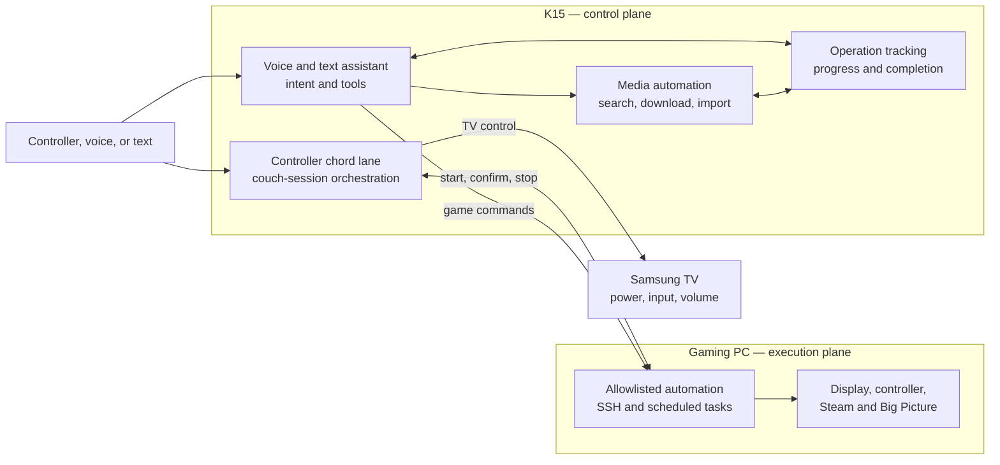
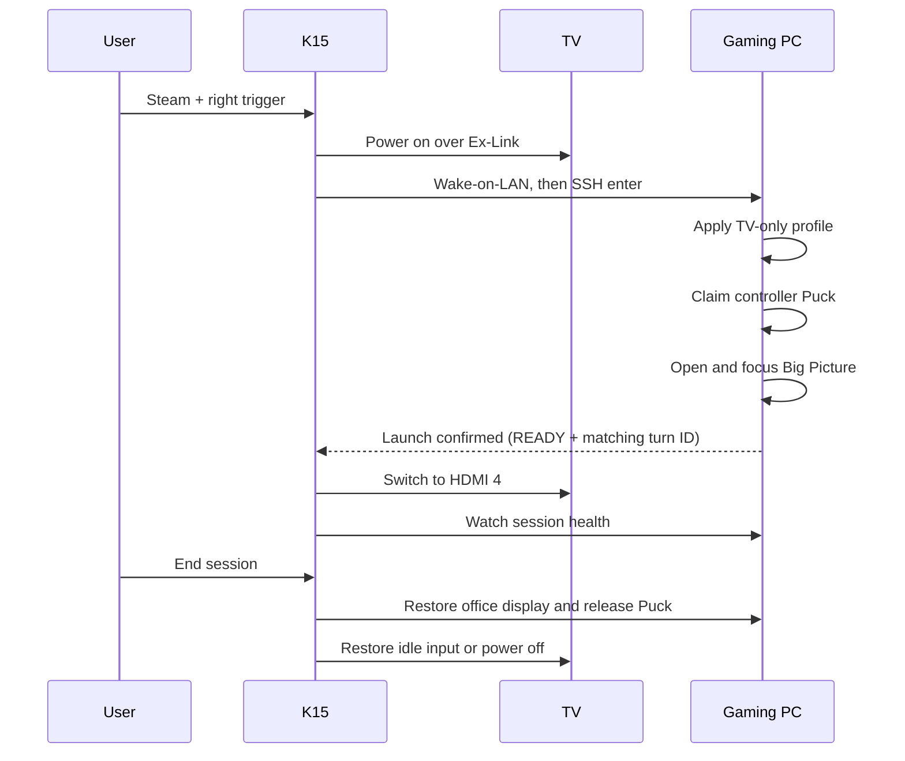

# slopstation

[](https://github.com/trillville/slopstation/actions/workflows/ci.yml)

Slopstation turns a Windows gaming PC, a Samsung S90C, and a Steam Controller
into a couch console. A GMKtec K15 mini PC owns orchestration: it can start a
session from a controller chord, accept voice and text commands, and track
long-running Steam and media work across restarts.

Hold **Steam + right trigger** for two seconds, or say **“hey jarvis, play
Armored Core Six.”**

## Architecture



The system has three operating constraints:

- **Nothing switches the TV to HDMI 4 until the gaming PC confirms a successful
  launch.** That acknowledgement is named `READY` in the protocol. A failed
  launch leaves the viewer’s current input unchanged.
- **The chord lane is independent of voice.** Core K15 modules use system
  Python and the standard library; the voice overlay has its own virtual
  environment and may fail without taking down controller launch.
- **External systems own long-running work.** Steam, Radarr, and Sonarr execute
  operations. Slopstation records correlation and progress, then resumes
  observation after a restart.

## Couch session lifecycle



`couch.py` owns the launch lock and watch loop. The gaming PC performs display,
USB, and Steam mutations through scheduled tasks. Teardown wins over launch;
launch waits for an active teardown and aborts if it cannot obtain a clean
starting state.

## Voice, text, and tools

The voice overlay listens locally for the wake word, streams speech to
Deepgram, and sends each final transcript through two paths:

1. `grammar_gate.py` handles deterministic room and gaming commands.
2. `assistant.py` handles open-ended requests through typed tools.

Shared room and gaming actions use `dispatch.py`; assistant tools add Steam and
media integrations. The authenticated text client, `k15/slop.py`, reaches the
same assistant and tools over the K15 LAN endpoint. Voice and text therefore
share media resolution, Steam actions, deletion guards, and operation status.

Long-running work is stored in `k15/state/operations.json`. Each record names
the originating turn, authority, external resource, state, progress, and
announcement status. Background monitors reconcile active records every 30
seconds. An unreachable authority becomes `UNKNOWN`, not failed. Terminal
results remain pending until spoken or retrieved through the assistant.

See [the media runbook](k15/media/README.md) for the Radarr/Sonarr pipeline.

## Runtime layout

| Area | Host | Runtime | Update path |
|---|---|---|---|
| `k15/` | `K15` | Repository clone on the Desktop | `git pull`, then `Start-K15.bat` |
| `gaming-pc/` | `TILLMAN-DESKTOP` | `C:\CouchGaming` | Run `gaming-pc\Deploy.ps1` from a PC checkout |
| `wake-training/` | Gaming PC | Checkout plus external training data | Run in place; GPU required |

The gaming PC is deployed by copy because its runtime also contains
machine-generated DisplayMagician shortcuts and the VirtualHere client.
`Deploy.ps1` copies one checked script set and stamps `build-id`; K15 doctor
compares that stamp with its own checkout to detect skew.

The forced SSH surface is intentionally small: `enter`, `exit`, `status`,
`enterstate`, `version`, `games`, `playing`, `collections`, `launch`, `stop`,
and constrained `nav` targets. Mutating verbs also accept a `--turn <hex>`
correlation suffix; every other command returns `DENIED`.

### Repository map

| Path | Responsibility |
|---|---|
| `k15/couch.py`, `chord_listener.py` | Session orchestration and controller input |
| `k15/tv.py`, `haptics.py`, `gamepc.py` | Hardware and gaming-PC boundaries |
| `k15/events.py`, `cglib.py`, `doctor.py` | State, telemetry, configuration, and diagnostics |
| `k15/voice/` | Wake word, speech pipeline, assistant tools, durable operations, and text server |
| `k15/media/` | Docker Compose media services and their runbook |
| `gaming-pc/` | Forced SSH dispatcher and scheduled-task implementations |
| `wake-training/` | Wake-word training and evaluation |

## Bootstrap

### K15

1. Clone the repository to `C:\Users\minipc\Desktop\slopstation` and ensure
   Python is on `PATH`.
2. Copy `k15\config.example.json` to `k15\config.json` and
   `k15\secrets.template.json` to `k15\secrets.json`. Set device names,
   addresses, API keys, and local tokens; both destination files are ignored by
   Git. `tvIp` enables TV-state evidence and is required for volume ducking.
3. Install the VirtualHere server and connect the TV’s Ex-Link adapter. The
   configured COM port must identify the Ex-Link device.
4. Run `k15\Start-K15.bat`. The first voice start creates its virtual
   environment and installs the pinned dependencies.
5. Put a shortcut to `Start-K15.bat` in `shell:startup`.
6. If TV volume ducking is enabled, run
   `.venv\Scripts\python tv_remote.py pair` from `k15\voice` and accept the TV
   prompt.
7. Run `python doctor.py` from `k15` until no checks fail.

### Gaming PC

1. Install Steam, DisplayMagician, VirtualHere Client, and Windows OpenSSH
   Server. Create working `OFFICE.lnk` and `TV-GAMING.lnk` DisplayMagician
   profiles.
2. Configure the `CouchGaming` scheduled tasks and the forced SSH command in
   `C:\ProgramData\ssh\administrators_authorized_keys`. The exposed command
   surface is the allowlist in `Dispatch.ps1`.
3. From a repository checkout on the PC, run:

   ```powershell
   powershell -NoProfile -ExecutionPolicy Bypass -File .\gaming-pc\Deploy.ps1
   ```

4. Run the deployed doctor until no checks fail:

   ```powershell
   powershell -NoProfile -ExecutionPolicy Bypass -File C:\CouchGaming\Doctor.ps1
   ```

Media acquisition is optional and has a separate ordered bootstrap in
[`k15/media/README.md`](k15/media/README.md).

## Operate and diagnose

After updating the K15 checkout:

```powershell
git pull
cd k15
.\Start-K15.bat
python doctor.py
```

`Start-K15.bat` starts missing supervisors or reloads only their child agents.
It does not replace an active couch-session watch loop, and it does not start
the optional media Compose stack. Docker Desktop restores those containers
independently after their initial setup.

Useful commands:

```powershell
# General text interface
python k15\slop.py
python k15\slop.py "what is downloading?"

# Durable Steam and media work
cd k15\voice
.venv\Scripts\python operations.py list
.venv\Scripts\python operations.py list --active
.venv\Scripts\python operations.py show <operation-id>
.venv\Scripts\python operations.py reconcile
```

`operations.py abandon <operation-id> --execute` performs authoritative media
cleanup through Radarr or Sonarr. The generic `cancel` command refuses work it
cannot safely cancel at the external authority.

The text endpoint requires `textInterfaceToken`. Bind it to `0.0.0.0` only for
LAN access, allow its port on the Windows **Private** profile for `LocalSubnet`,
and provide `SLOPSTATION_URL` and `SLOPSTATION_TOKEN` on remote clients.

## Telemetry

Every intent carries a `turn` ID through K15 and gaming-PC events. Local JSONL
is the source of truth:

- K15: `k15\logs\k15-YYYYMMDD.jsonl`
- Gaming PC tasks: `C:\CouchGaming\logs\pc-YYYYMMDD.jsonl`
- Forced SSH dispatcher: `C:\CouchGaming\logs\pc-dispatch-YYYYMMDD.jsonl`

Grafana Alloy mirrors these files to Loki; Langfuse holds assistant traces.
Use the repository’s Grafana and Langfuse skills for remote diagnosis.

## Tests

Run the blind suite as scripts, not through pytest:

```powershell
cd k15\voice
.venv\Scripts\python tests\run.py
```

Hardware-bound Steam and audio tests skip when their devices are absent;
`--all` forces them. GitHub Actions runs the blind suite and mypy on Windows for
every pull request.

## Fixed rig contract

| Component | Current value |
|---|---|
| Gaming PC | `TILLMAN-DESKTOP`, `192.168.68.67`, user `tillm` |
| K15 | `K15`, `192.168.68.75`, user `minipc` |
| TV | Samsung S90C, HDMI 4 for PC, Ex-Link on K15 `COM3` |
| Controller Puck | VirtualHere device `K15.5`, VID `28DE`, PID `1304` |
| Audio | HW-Q990C over eARC; volume writes use TV WebSocket remote keys |
| TV-primary probe | Primary display height equals `2160` |

Revisit the display probe before adding another 2160-pixel-high desk display.
The TV acknowledges unsupported Ex-Link volume commands but does not apply
them; `tv_remote.py` is the working volume path.

Runtime-only state is intentionally absent from Git: real config and secrets,
VirtualHere binaries and PINs, DisplayMagician shortcuts, scheduled-task
registrations, SSH/firewall state, logs, operation state, voice virtual
environment, and wake-training data.
