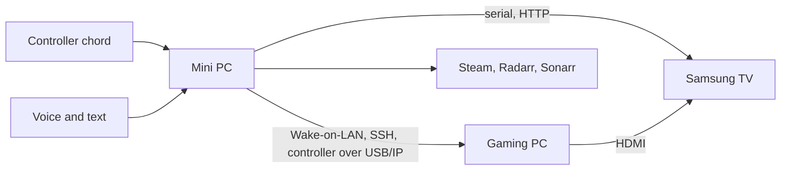

# slopstation

[](https://github.com/trillville/slopstation/actions/workflows/ci.yml)
[](https://github.com/trillville/slopstation/actions/workflows/cd.yml)

Slopstation turns a Windows gaming PC, a Samsung TV, and a Steam Controller
into a couch console. An always-on mini PC controls the TV and the gaming PC,
takes voice and text commands, and tracks Steam and media downloads. Press a
controller chord on the couch and the TV comes on, the PC wakes, and Steam Big
Picture is on screen with the controller working. Say "hey Alfred, play Hades"
and it launches.

It is one household's system, run every day and deployed from this
repository. It is not a framework.

## How a session starts



1. The mini PC powers on the TV, switches it to the PC's input, and wakes the
   gaming PC.
2. Over SSH, the mini PC tells the gaming PC to enter. The PC switches to its TV
   display profile, claims the controller over USB-over-IP, and opens Steam
   Big Picture.
3. The gaming PC returns `READY` with the request's turn id.
4. The mini PC confirms the TV input and watches the session until it ends.
5. The gaming PC restores the office display and releases the controller.

A failed launch that woke the TV turns it off again. Controller input and
voice run as separate processes, so either can restart on its own.

## Reference hardware

| Component | Used here |
|---|---|
| Gaming PC | Windows 11, wired Ethernet with Wake-on-LAN, Steam, DisplayMagician, VirtualHere client, Windows OpenSSH server |
| Mini PC | GMKtec K15, Windows 11, always on. Runs Slopstation, the VirtualHere server, and the optional media stack. The code calls this machine the K15: in task names, the runner label, log file names and `K15_CHECKOUT` |
| TV | Samsung S90C. Gaming PC on HDMI 4, Ex-Link serial adapter on the mini PC |
| Controller | Steam Controller, its Puck receiver plugged into the mini PC and shared to the gaming PC over VirtualHere |
| Audio | Samsung HW-Q990C soundbar over eARC |
| Speech | openWakeWord, Deepgram for speech to text and text to speech, Anthropic or OpenAI for the assistant |

The TV is the one hard dependency on a brand. Power and input go over Ex-Link,
Samsung's serial control protocol. Volume and mute use UPnP over HTTP, with
readback to verify changes. Another make of TV means adapting `tv.py`.

The custom wake model in `src/slopstation/agent/models` was trained by the
author on recordings from this room with
[slopstation-voice-lab](https://github.com/trillville/slopstation-voice-lab).
It is the author's own work and is covered by this repository's MIT license.
The stock `hey_jarvis_v0.1` model in `config.example.json` works without it.

## Evaluating without the hardware

Clone, create the virtual environment, and run the tests. Tests that need a
local Steam installation or real audio devices skip themselves.

```powershell
python -m venv .venv
.venv\Scripts\pip install -e ".[dev]" -c constraints.txt
.venv\Scripts\pytest
```

Then read `src/slopstation/couch.py` for the launch,
`gaming-pc/Dispatch.ps1` for the PC side, and
`src/slopstation/agent/dispatch.py` for the assistant's actions.

## Documentation

| Document | Contents |
|---|---|
| [docs/setup.md](docs/setup.md) | installing the mini PC and the gaming PC, and the CD runners |
| [docs/configuration.md](docs/configuration.md) | every value an operator sets, the file that owns it, and what breaks without it |
| [docs/operations.md](docs/operations.md) | deploying, the doctors, diagnosing with the turn id, recovery |
| [media/README.md](media/README.md) | the optional Radarr, Sonarr, and qBittorrent stack |
| [CLAUDE.md](CLAUDE.md) | process rules for agent sessions working in this repository |

## Repository layout

| Path | Purpose |
|---|---|
| `src/slopstation/couch.py` | Start, watch, and end couch sessions |
| `src/slopstation/chord_listener.py` | Listen for the controller chord |
| `src/slopstation/text_client.py` | Send text commands from a terminal |
| `src/slopstation/tv.py`, `haptics.py`, `gamepc.py` | Device interfaces for the TV, controller, and gaming PC |
| `src/slopstation/agent/voice.py` | Run the voice service |
| `src/slopstation/agent/speech/` | Wake word, audio, and fixed voice commands |
| `src/slopstation/agent/llm/` | Assistant prompts and model providers |
| `src/slopstation/agent/dispatch.py` | Actions shared by voice and text commands |
| `src/slopstation/agent/tools/` | Steam, media, operation, and TV tools |
| `src/slopstation/agent/interfaces/` | Text and MCP interfaces |
| `gaming-pc/` | Gaming-PC scripts, the SSH command allowlist, and the installer |
| `media/` | Optional media stack and its setup guide |
| `docs/` | Setup, configuration, and operations |
| `tests/` | Python and PowerShell tests |

Runtime configuration, secrets, media state, VirtualHere files,
DisplayMagician shortcuts, scheduled tasks, logs, and the virtual environment
are not stored in Git.

## License

MIT. See [LICENSE](LICENSE).
