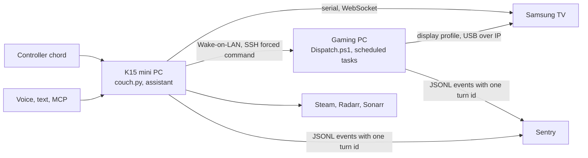

# slopstation

[](https://github.com/trillville/slopstation/actions/workflows/ci.yml)
[](https://github.com/trillville/slopstation/actions/workflows/cd.yml)

Slopstation turns a Windows gaming PC, a Samsung TV, and a Steam Controller
into a couch console. A small always-on PC (a GMKtec K15) controls the TV and
the gaming PC, takes voice and text commands, and tracks Steam and media
downloads. Press a controller chord on the couch and the TV comes on, the PC
wakes, and Steam Big Picture is on screen with the controller working. Say
"hey Alfred, play Hades" and it launches.

It is one household's system, run every day and deployed from this
repository. It is not a framework.

## How a session starts



1. The K15 powers on the TV, switches it to the PC's input, and wakes the
   gaming PC.
2. Over SSH, the K15 tells the gaming PC to enter. The PC switches to its TV
   display profile, claims the controller over USB-over-IP, and opens Steam
   Big Picture.
3. The gaming PC returns `READY` with the request's turn id.
4. The K15 confirms the TV input and watches the session until it ends.
5. The gaming PC restores the office display and releases the controller.

A failed launch that woke the TV turns it off again. Controller input and
voice run as separate processes, so either can restart on its own.

## What is interesting about it

**Deploys that respect the couch.** Both machines run self-hosted GitHub
runners. A green `ci` on `main` deploys to each, but a deploy waits up to two
hours for a live session to end and fails rather than interrupting one. It
never rolls back. Each leg ends with a doctor whose exit code is its failure
count, so a broken deploy is red with a diagnosis instead of a silent
half-install.

**One turn id across two machines.** Every launch and voice command gets a
short hex id. It rides the SSH verb as `--turn`, the gaming PC writes it to a
marker, the PC's scheduled tasks stamp it into their events and transcript
filenames, and both machines ship logs to one Sentry project. One query shows
a launch from the chord to Big Picture.

**A narrow SSH surface.** The K15's key on the gaming PC is bound to a forced
command. `Dispatch.ps1` accepts a dozen anchored verbs such as `enter`,
`launch <appid>`, `nav library`, and `status`, and denies everything else.
The turn id is validated by an anchored regex before it can become part of a
filename. Interactive Steam work runs through scheduled tasks in the logged-in
session, never in the SSH session.

**Durable operations.** Steam installs and media requests are long-running
work done by other services. Slopstation records each one in
`state/operations.json` with a small state machine, reports progress from
that file, and reconciles it after a restart, so "what is downloading?" has an
answer even if the voice process was just restarted.

## Reference hardware

| Component | Used here |
|---|---|
| Gaming PC | Windows 11, wired Ethernet with Wake-on-LAN, Steam, DisplayMagician, VirtualHere client, Windows OpenSSH server |
| K15 | GMKtec K15 mini PC, Windows 11, always on. Runs Slopstation, the VirtualHere server, and the optional media stack |
| TV | Samsung S90C. Gaming PC on HDMI 4, Ex-Link serial adapter on the K15 |
| Controller | Steam Controller, its Puck receiver plugged into the K15 and shared to the gaming PC over VirtualHere |
| Audio | Samsung HW-Q990C soundbar over eARC |
| Speech | openWakeWord, Deepgram for speech to text and text to speech, Anthropic or OpenAI for the assistant |

The gaming-PC scripts still carry a few of this house's values in
`gaming-pc/CouchGaming.common.ps1`: the controller name and hardware id, the
TV's EDID name, and the display height that identifies the TV. Edit them
there for now.

The custom wake model in `src/slopstation/agent/models` was trained by the
author on recordings from this room with
[slopstation-voice-lab](https://github.com/trillville/slopstation-voice-lab).
The stock `hey_jarvis_v0.1` model in `config.example.json` works without it.

## Evaluating without the hardware

Clone, create the virtual environment, and run the tests. Tests that need a
local Steam installation or real audio devices skip themselves.

```powershell
python -m venv .venv
.venv\Scripts\pip install -e ".[dev]" -c constraints.txt
.venv\Scripts\pytest
```

Then read `src/slopstation/couch.py` for the launch,
`gaming-pc/Dispatch.ps1` for the PC side, and
`src/slopstation/agent/dispatch.py` for the assistant's actions.

## Repository layout

| Path | Purpose |
|---|---|
| `src/slopstation/couch.py` | Start, watch, and end couch sessions |
| `src/slopstation/chord_listener.py` | Listen for the controller chord |
| `src/slopstation/text_client.py` | Send text commands from a terminal |
| `src/slopstation/tv.py`, `haptics.py`, `gamepc.py` | TV, controller, and gaming-PC access |
| `src/slopstation/agent/voice.py` | Run the voice service |
| `src/slopstation/agent/speech/` | Wake word, audio, and fixed voice commands |
| `src/slopstation/agent/llm/` | Assistant prompts and model providers |
| `src/slopstation/agent/dispatch.py` | Actions shared by voice and text commands |
| `src/slopstation/agent/tools/` | Steam, media, operation, and TV tools |
| `src/slopstation/agent/interfaces/` | Text and MCP interfaces |
| `gaming-pc/` | Gaming-PC scripts and the SSH command allowlist |
| `media/` | Optional media stack and its [setup guide](media/README.md) |
| `tests/` | Python and PowerShell tests |

## Install the K15

1. Clone the repository, for example to `C:\slopstation`.
2. Copy `config.example.json` to `config.json` and
   `secrets.example.json` to `secrets.json`, then fill in device names,
   addresses, API keys, and tokens. Both destination files are ignored by Git.
3. Create the virtual environment and install the package:

   ```powershell
   python -m venv .venv
   .venv\Scripts\pip install -e ".[dev]" -c constraints.txt
   ```

4. Install VirtualHere Server, reserve the K15's address in DHCP, and allow its
   port on the private LAN:

   ```powershell
   New-NetFirewallRule -DisplayName 'VirtualHere USB hub (LAN)' -Direction Inbound -Action Allow -Protocol TCP -LocalPort 7575 -Profile Private -RemoteAddress LocalSubnet
   ```

5. Connect the TV's Ex-Link adapter and set its COM port in `config.json`.
6. Register and start the controller and voice tasks from a non-administrator
   PowerShell window:

   ```powershell
   .\Setup-K15-Tasks.ps1
   .\Start-Slopstation.bat
   ```

7. If volume ducking is enabled, pair the TV remote and accept the TV prompt:

   ```powershell
   .venv\Scripts\python -m slopstation.agent.tools.tv_remote pair
   ```

8. Run `.venv\Scripts\slopstation-doctor` until no checks fail.

### Optional MCP access

MCP forwards requests to the existing text interface.

1. Set `textInterfaceToken` and `remoteInterfaceToken` in `secrets.json`.
   Each token should contain at least 32 random bytes.
2. Enable `textInterface` and `remoteInterface` in `config.json`. Keep the
   remote interface on `127.0.0.1:8766`.
3. Route a Cloudflare named tunnel to `http://127.0.0.1:8766` and restrict the
   public hostname to the connector's documented source addresses.
4. Add a custom connector for `https://<host>/mcp` with
   `Authorization: Bearer <remoteInterfaceToken>`.
5. Restart Slopstation and run the doctor.

The MCP endpoint holds no assistant state and does not expose a separate set
of tools.

## Install the gaming PC

1. Install Steam, DisplayMagician, VirtualHere Client, and Windows OpenSSH
   Server.
2. Create working `OFFICE.lnk` and `TV-GAMING.lnk` DisplayMagician profiles.
3. Configure the `CouchGaming` scheduled tasks and set `Dispatch.ps1` as the
   forced command for the K15's key in
   `C:\ProgramData\ssh\administrators_authorized_keys`. `Doctor.ps1` lists
   the seven tasks and the firewall rule it expects.
4. Deploy from a repository checkout:

   ```powershell
   powershell -NoProfile -ExecutionPolicy Bypass -File .\gaming-pc\Deploy.ps1
   ```

5. Run the deployed doctor:

   ```powershell
   powershell -NoProfile -ExecutionPolicy Bypass -File C:\CouchGaming\Doctor.ps1
   ```

For Radarr, Sonarr, and qBittorrent setup, see
[media/README.md](media/README.md).

## Deployment

A successful `ci` run on `main` starts `cd`. The K15 deploys immediately; the
gaming-PC job waits until that machine wakes. Both machines use self-hosted
runners because they do not accept inbound deployment connections.

Deployments wait for active couch sessions to finish. They fail instead of
interrupting a session or rolling back automatically. Because this repository
is public, `cd` only deploys commits pushed to `main`; pull-request code never
runs on either machine.

Register repository runners with the labels `k15` and `gamepc`. Run them in the
logged-in desktop session, not as services. The K15 runner executes the live
checkout directly; set the `K15_CHECKOUT` repository variable to that
checkout's path.

To update the K15 manually:

```powershell
git pull
.\Start-Slopstation.bat
.venv\Scripts\slopstation-doctor
```

## Common commands

```powershell
# Text interface
.venv\Scripts\slopstation-text
.venv\Scripts\slopstation-text "what is downloading?"

# Tracked Steam and media work
.venv\Scripts\python -m slopstation.agent.tools.operations list --active
.venv\Scripts\python -m slopstation.agent.tools.operations show <operation-id>
.venv\Scripts\python -m slopstation.agent.tools.operations reconcile
```

`operations abandon <operation-id> --execute` removes a tracked media request
through Radarr or Sonarr.

For LAN text access, bind the text endpoint to `0.0.0.0`, restrict its firewall
rule to `LocalSubnet` on the Private profile, and set `SLOPSTATION_URL` and
`SLOPSTATION_TOKEN` on each client. MCP remains on localhost behind its tunnel.

## Telemetry

Structured events are written to:

- K15: `logs\k15-YYYYMMDD.jsonl`
- Gaming-PC tasks: `C:\CouchGaming\logs\pc-YYYYMMDD.jsonl`
- Gaming-PC SSH dispatcher: `C:\CouchGaming\logs\pc-dispatch-YYYYMMDD.jsonl`

The OpenTelemetry Collector configurations in `otelcol/config.yaml.example`
and `gaming-pc/otelcol/config.yaml.example` send those logs to Sentry. The
voice process also sends errors and traces when `sentryDsn` is configured.

## Development

Run the same checks as CI:

```powershell
.venv\Scripts\pytest
.venv\Scripts\ruff check .
.venv\Scripts\mypy
```

Tests that require a local Steam installation skip when it is absent. Tests
that open real audio devices require `SLOPSTATION_TEST_AUDIO=1`.

Runtime configuration, secrets, media state, VirtualHere files,
DisplayMagician shortcuts, scheduled tasks, logs, and the virtual environment
are not stored in Git.

## License

MIT. See [LICENSE](LICENSE).
