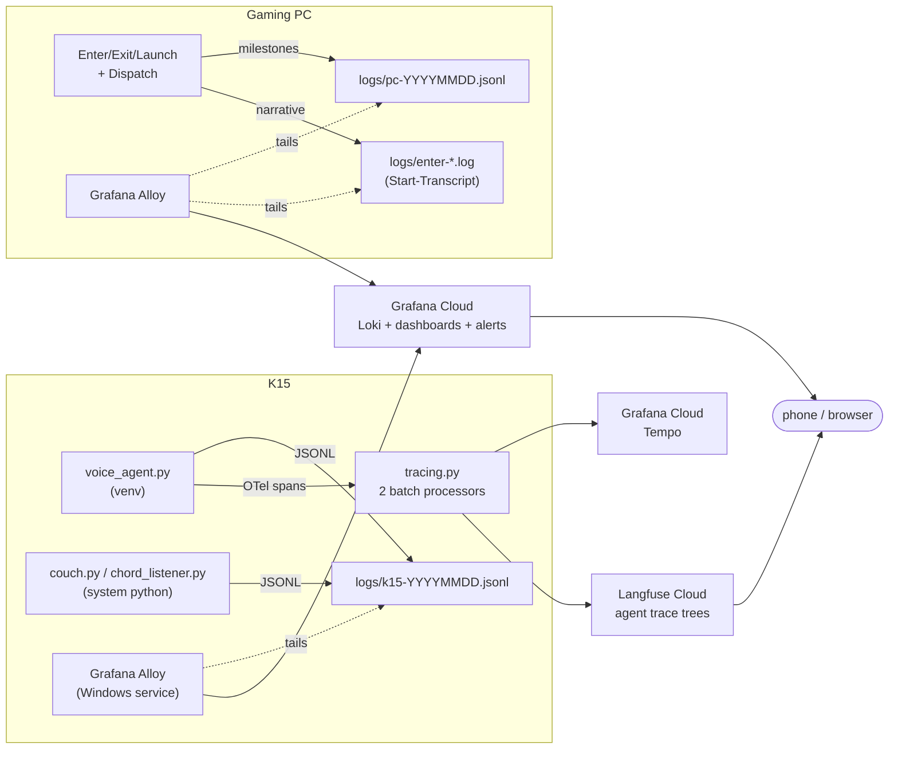

# Observability (Project E) — design

**Status: E0, E1, E2, E5 BUILT and E3's code done (2026-08-11), blind suite
green at 18/18. Logs are live in Grafana Cloud; agent traces go to Langfuse.
Outstanding: importing the alert rules, and the E6 clock-skew check.** This is the as-designed record for making the couch system legible
from a phone: what it emits, where that goes, what it costs, and the order to
build it in. Written 2026-08-11 after a survey of the free-tier landscape;
load-bearing claims cited inline. Verdicts live in
[Decisions and open questions](#decisions-and-open-questions) — one build-time
check (clock skew) is the only thing still open, and it is cosmetic.

Everything through E1 is local: structured events, levels, the scrubber, and
one `turn` id carried from the wake word or the chord to the gaming PC's
scheduled task. No account, no credential, no network call. What the build
taught is recorded in [What E0/E1 found](#what-e0e1-found) — two of the three
findings were in code this plan was not otherwise touching.

Every file reference and line number below was re-verified against `adb1992`
("the repo a new person would want"), which rewrote `cglib.py`, `exlink.py`,
and `voice_agent.py` and deleted `spike.py`. Nothing this plan depends on
moved: the five `make_log` lanes, `rotate_log`'s rename, and the `couch.log`
contract all survived unchanged.

The verdict up front: **Grafana Cloud** for the ops lane (logs, dashboards,
alerts) and **Langfuse** for the agent lane (trace trees, tokens, cost). Both
free forever at this volume, both hosted, nothing self-hosted on the K15. The
work that actually matters is not the vendors — it's giving every event a
shape and every user intent an id.

## Why now

Two questions currently require RDP and a scrollback hunt:

1. *Something misbehaved while I was on the couch — what?* The evidence is
   split across `k15/couch.log` and `C:\CouchGaming\logs\enter-*.log` on the
   gaming PC, with no shared identifier. You correlate by eyeballing clocks.
2. *Why did the assistant say that / take six seconds / cost that much?*
   `state/traces/*.json` has the messages but no timeline, no token counts,
   and no link back to the log lines that surrounded it.

And one question nothing can answer today: *is the house even up right now?*
A dead process writes no logs. Silence and idle look identical.

## What exists today (the honest baseline)

| Surface | Today | Gap |
|---|---|---|
| K15 logs | [`cglib.make_log(tag)`](../k15/cglib.py) → `[stamp] [tag] free text`, print + append to one `couch.log`, 5 MB two-generation rotation, ~126 call sites | No levels, no fields, no ids, local-only |
| PC logs | `Start-CgTranscript` per run → `logs/{tag}-{stamp}.log`, stopwatch prefix, 30-day cleanup | Local-only; never correlated with the K15 |
| Agent traces | [`voice/traces.py`](../k15/voice/traces.py) → one JSON per conversation, 14-day TTL | Messages only: no spans, no latency, no tokens |
| Jobs | `state/jobs.json`, last 10 finished, created/finished stamps | Not queryable, not alertable |
| Errors | `state/last_error` + a great many fail-soft `except` blocks that log and continue | Never counted, never aggregated, never alerted |
| Latency | Three ad-hoc `t0 = time.time()` sites; PC stopwatch prefixes | Not a metric, not a distribution |
| LLM cost | [`assistant.py`](../k15/voice/assistant.py) computes cache read/write tokens, formats them into a display string, discards them | Invisible |

One more finding worth recording, because it is the whole thesis in miniature:
`couch.log` right now contains a `trace save failed (WinError 183 … \blocker)`
line every ten minutes. That is [`test_traces.py`](../k15/voice/tests/test_traces.py)
exercising its fail-soft path — **the blind suite writes into the production
log, in a shape indistinguishable from a real failure.** Any alert on that
string would fire on every test run. Structure is what tells a drill from an
outage.

## Requirements

1. **Legible from a phone.** Logs, errors, and agent traces readable in a
   browser, from the couch or from anywhere, with no RDP and no VPN hop.
2. **One id per intent.** "hey jarvis, play hades" produces *one* story
   spanning two machines, three processes, and an SSH boundary.
3. **Agent traces are trees, not transcripts.** wake → STT → gate → LLM →
   dispatch → TTS, each with its own duration, with prompt/completion and
   token counts on the LLM node.
4. **Told when it breaks, not asked.** A dead lane, a failed launch, or an
   error burst reaches me without my looking.
5. **Free, and honestly free** — inside permanent free tiers at real volume,
   not a trial.
6. **Zero new load-bearing parts.** Telemetry is an overlay on an overlay. It
   must not be able to take down a launch, and it must not add a dependency to
   the chord lane.

## The house rules for telemetry

These are invariants, in the same spirit as *the one rule* and *voice is never
load-bearing*. Everything below is downstream of them.

- **Telemetry never costs a session.** Every emit is fire-and-forget: local
  file writes, batched off-thread exporters, drop-on-backpressure. The existing
  [`traces.py`](../k15/voice/traces.py) docstring already says this; it becomes
  policy.
- **`couch.log` stays the offline truth.** The cloud is a mirror. Every local
  file `doctor.py` reads stays where it is, and a K15 with no uplink loses
  nothing but the mirror.
- **The chord lane gains zero dependencies.** Structured logging is stdlib
  JSON. No OpenTelemetry, no HTTP client, no network call in `chord_listener.py`
  or `couch.py`.
- **Labels are low-cardinality; everything else is a field.** `service`,
  `lane`, `level`, `env` are labels. `turn`, `session`, `appid`, `score` are
  fields inside the line. This is the rule that keeps a free tier free — an id
  used as a label creates one stream per launch and blows the index.
- **Secrets never leave.** One scrubber, applied at the emit boundary, tested
  blind.

## Architecture



### Three decisions that make this clean

**Logs travel as files, tailed by an agent — not through the OTel logs SDK.**
The Python logs signal is still `opentelemetry.sdk._logs` (underscore-private,
[no backward-compatibility guarantee](https://opentelemetry-python.readthedocs.io/en/stable/sdk/_logs.html)),
and the SDK's `LoggingHandler` is deprecated in favour of a contrib package.
Beyond stability: a file that Alloy tails **survives the process that wrote
it**. An in-process exporter loses its buffer in exactly the crash you most
want to read about. And it keeps the network out of the chord lane entirely.

**Traces use the OTel SDK, and only inside the voice venv.** The trace API is
stable, and the agent lane is where a waterfall actually earns its keep. The
launch lane gets a span from the *caller's* side (the voice agent holds one
open around the `couch.py` subprocess) and logs for the guts — you get the
duration and the outcome in the tree, and click through to Loki by `turn` for
the detail.

**No metrics SDK in v1.** Every number worth watching is derivable from the
log stream in LogQL (`rate`, `count_over_time`, `quantile_over_time` on
extracted fields). That is one fewer signal, one fewer exporter, one fewer set
of pins. Revisit only if a dashboard gets slow.

## Part 1 — Structured events

This is the part that matters, and the part that is vendor-independent. If only
this ships, the system is already dramatically more debuggable over RDP.

### The line

Every event is one JSON object, one line, appended to a daily file:

```json
{"ts":"2026-08-11T13:38:05.123Z","level":"info","env":"prod","service":"k15",
 "lane":"voice","event":"gate_match","turn":"9f2c1a","session":"3b7e",
 "verb":"launch","title":"Hades II","confidence":94,"dur_ms":38}
```

Reserved keys — `ts`, `level`, `env`, `service`, `lane`, `event`, `turn`,
`session`, `job`, `dur_ms`, `err`. Everything else is free-form and typed.

`level` is `debug | info | warn | error`. The rule for choosing: **warn** is a
fail-soft that self-healed and cost the user nothing; **error** is a fail-soft
that lost user-visible function. The test is "do I want to know about this
tomorrow morning?"

`env` is `prod` or `test`, and it is **auto-detected** (`sys.argv[0]` under a
`tests/` directory) rather than opt-in — the failure being fixed is precisely a
test that forgot to say it was a test, so an opt-in flag would have reproduced
it. As built this went one better than planned: under `env=test` the events go
to `logs/test-YYYYMMDD.jsonl` instead of the shipped file and the `couch.log`
append is skipped entirely, so Alloy's glob never even sees drill traffic. The
field remains as belt-and-braces for anything that slips through. That closes
the `WinError 183` noise at the source rather than filtering it downstream.

### Event names are an API

`event` is what you alert on and group by, so it is a small closed vocabulary
of `verb_noun` strings, and **variable data never goes in the name**. Today's
`f"meta {appid} fetched"` becomes `event="meta_fetched", appid=3`. Draft
vocabulary:

| Lane | Events |
|---|---|
| `voice` | `wake`, `wake_false`, `stt_final`, `gate_match`, `gate_miss`, `llm_reply`, `tool_call`, `tts_first_audio`, `session_open`, `session_close`, `heartbeat` |
| `launch` | `launch_start`, `wol_sent`, `ssh_up`, `enter_dispatched`, `host_ready`, `launch_failed`, `session_end`, `exlink_send`, `exlink_nak` |
| `listener` | `chord`, `chord_busy`, `armed`, `puck_present`, `puck_vanished`, `puck_standoff`, `buzz_sent`, `buzz_failed`, `launch_failure_signaled`, `stale_error_discarded`, `heartbeat` |
| `library` | `sync_start`, `sync_done`, `meta_fetched`, `meta_failed` |
| `jobs` | `job_queued`, `job_running`, `job_done`, `job_failed`, `job_announced` |
| `supervisor` | `start`, `restart` (with exit code), `bounce` — emitted by the `.bat` supervisors via the `events.py` CLI |
| `pc` | `enter_start`, `profile_applied`, `puck_claimed`, `ready` (with `focused` + `fg`), `enter_failed`, `exit_start`, `exit_done`, `game_launched`, `game_resumed`, `game_resume_failed` |
| `doctor` | `doctor_result` (with pass/warn/fail counts) |

### The API

Small enough that ~126 call sites migrate mechanically, and shaped so the
human line survives unchanged:

```python
log = cglib.make_log("voice")          # unchanged signature, still prints
log("wake", score=0.71)                # -> [voice] wake score=0.71   + JSONL
log.warn("earcon_failed", err=repr(e))
log.error("exlink_nak", frame=f, answer=ack)
```

New module `k15/events.py` (stdlib only, importable from system python) owns
the JSONL writer, the scrubber, and the daily-file naming. `cglib.make_log`
keeps its current contract and gains the structured emit, so nothing that
imports it breaks mid-migration.

### The `turn` id — the single highest-value change

Six hex characters, minted once per user intent, threaded end to end:

```
wake (voice_agent mints "9f2c1a")
  → grammar gate      → dispatch
  → couch.py start <appid> --turn 9f2c1a
  → ssh gamepc enter --turn 9f2c1a
  → Dispatch.ps1 validates, passes to Enter-TV.ps1
  → Start-CgTranscript names the file with it; every Log line carries it
```

One Loki query (`{env="prod"} | json | turn="9f2c1a"`) then returns the whole
story across both machines in time order. That is what turns two log files into
a trace, and it costs almost nothing.

**Security note, because this crosses the SSH boundary.** `Dispatch.ps1` is the
entire remote attack surface and is deliberately dependency-free. The id
argument must be validated `^[0-9a-f]{1,8}$` *before* it is used, and it is used
in a filename — so an unvalidated id is a path-traversal primitive. Validation
lives in `Dispatch.ps1`, before dispatch, and gets its own blind test. Anything
non-conforming is dropped (the launch proceeds without correlation; telemetry
never costs a session).

### Rotation, and a Windows gotcha

Today `rotate_log` renames `couch.log` → `couch.log.1`. Renaming a file that
Alloy holds open is a fight worth not having on Windows. Switch the structured
stream to **date-stamped daily files** (`logs/k15-20260811.jsonl`) matched by a
glob, with files older than 14 days deleted. No renames, no open-handle races,
and Alloy's position tracking stays valid. `couch.log` itself keeps its current
rotation — nothing tails it.

### `couch.log` earns its keep (Q6, decided)

**Keep it, permanently.** The duplication is real but it is not cruft, for two
reasons that survive scrutiny:

- **It has a writer that isn't Python.** [`Start-Listener.bat:25`](../k15/Start-Listener.bat)
  appends its supervisor line with a bare `echo >> couch.log` from cmd.exe.
  Any "retire the text log" plan has to answer for that line first.
- **It is the documented first move.** [troubleshooting.md](troubleshooting.md)
  opens with *"First move, always: tail `k15/couch.log`"*, and the voice drills
  ask for `couch.log` chunks by name. That is a real interface with a real
  user, and it works with zero tooling on a box that is misbehaving.

Both files come from the same `log()` call, so there is no drift risk — one
call site, two writes, one of them ugly-but-greppable and one of them
queryable. Cost is a few MB a month on a mini PC.

What *is* worth fixing while we're here: that cmd.exe supervisor line is
currently invisible to everything. A crash-restart loop in the chord lane —
the load-bearing lane — leaves no signal anyone watches. So E0 also adds a
tiny `events.py` CLI (`python events.py emit --lane supervisor --event
restart --code %errorlevel%`) that the three `.bat` supervisors call alongside
their existing echo, which makes "the listener restarted four times in ten
minutes" an alertable event instead of a line nobody reads.

## Part 2 — Spans

### What gets a span, and what deliberately doesn't

**Traced: user intents only.** A voice turn, a chord launch, a Tier-3 job.
**Not traced:** library sync, metadata fetches, heartbeats, the listener's idle
loop — those are logs and nothing else.

This is both good doctrine (a trace should mean "something a person asked for")
and the thing that keeps Langfuse's free tier comfortable. Tracing the 10-minute
library sync would triple unit consumption to describe work no one is waiting on.

### The tree

```
voice.turn                      session, turn, user       [root]
├── wake                        score
├── stt                         transcript, eager, final
├── gate                        matched, verb, confidence
├── llm.assistant               gen_ai.* (model, tokens, cache r/w)
│   └── tool.launch_game        args, result
├── dispatch.launch             appid, ok
│   └── launch.couch            ready_ms, outcome   (wraps the subprocess)
└── tts                         voice, ttfa_ms, chars
```

### Attributes

Langfuse renders from a documented attribute map, and honours `gen_ai.*` where
it exists — so emit both and everything works in both backends:

| Meaning | Attribute |
|---|---|
| Trace name | root span name, or `langfuse.trace.name` |
| Session | `langfuse.session.id` **and** `session.id` |
| User | `langfuse.user.id` (`tillman` — one user, but the UI needs it) |
| Prompt / completion | `langfuse.observation.input` / `.output`, plus `gen_ai.prompt` / `gen_ai.completion` |
| Model | `gen_ai.request.model`, `gen_ai.response.model` |
| Tokens | `gen_ai.usage.input_tokens`, `.output_tokens`, plus the cache read/write counts [`assistant.py`](../k15/voice/assistant.py) already computes and currently throws away |

Langfuse [asks that trace-level attributes appear on every span](https://langfuse.com/integrations/native/opentelemetry)
for reliable filtering, so a small helper stamps `session.id` / `user.id` on
each span at creation.

`gen_ai.*` semantic conventions are still **Development** status — as of
semconv v1.42.0 (June 2026) they moved to their own repo,
`open-telemetry/semantic-conventions-genai`, and nothing in the registry is
marked Stable. Pin the version targeted, keep the mapping in one file
(`voice/tracing.py`), and expect churn. Emitting `langfuse.*` alongside means
a semconv rename costs a Grafana dashboard, not the agent view.

### Dual export

One `TracerProvider`, two `BatchSpanProcessor`s — Grafana Tempo and Langfuse —
each with its own OTLP/HTTP exporter. Both batched and off-thread. The whole
setup sits in a `try`/`except` that falls back to a **no-op tracer**, so a bad
token or a dead uplink degrades to "no traces" and never to "no voice". OTel's
default error handling logs exporter failures loudly to stderr, which would
pollute `couch.log` — install a quiet handler that rate-limits to one warn per
minute.

Langfuse specifics: OTLP over **HTTP only** (no gRPC), endpoint
`https://cloud.langfuse.com/api/public/otel/v1/traces`, `Authorization: Basic
base64(pk:sk)`, plus `x-langfuse-ingestion-version: 4` for real-time ingestion.
Grafana: **US region** (decided 2026-08-11), endpoint
`https://otlp-gateway-<region>.grafana.net/otlp/v1/traces`, basic auth with
instance ID and token. Copy the exact `otlp-gateway-prod-us-*` hostname from the
OpenTelemetry tile in the Grafana Cloud stack rather than guessing it — the
region slug is per-stack. Note the documented Python quirk: the space in
`Basic ` must be written `Basic%20` inside `OTEL_EXPORTER_OTLP_HEADERS`.

## Part 3 — Shipping

**Grafana Alloy**, installed as a Windows service on both machines
(`winget install GrafanaLabs.Alloy`, or the installer with `/S` and
`/CONFIG=<path>`; config defaults to `%PROGRAMFILES%\GrafanaLabs\Alloy\config.alloy`).

Each machine's config is the same three components: match the daily JSONL glob,
parse the JSON to lift `level`/`lane` into labels, write to Grafana Cloud Loki.

**The gaming PC ships both, and this is not a compromise** (DECIDED 2026-08-11).
The two files answer different questions and neither substitutes for the other:

- `Log` in [`CouchGaming.common.ps1`](../gaming-pc/CouchGaming.common.ps1) gains
  a second write that appends a JSON line to `logs/pc-YYYYMMDD.jsonl` for the
  **milestones** — `enter_start`, `profile_applied`, `puck_claimed`, `ready`,
  `enter_failed`, `exit_done`. Those are what dashboards count, what alerts
  fire on, and what carries the `turn`.
- `Start-Transcript` keeps writing the full **narrative** to
  `logs/{tag}-{stamp}.log`, unchanged, shipped as-is under
  `lane="pc-transcript"`. A transcript captures every line of PowerShell
  output — including the things nobody thought to instrument, which is
  precisely what you need when an enter fails in a new way.

Converting the transcript to JSONL would mean either hand-instrumenting every
`Write-Host` (churn, and it would still miss unexpected output) or wrapping
each line in a JSON envelope that adds nothing (`{"msg":"[+  1.2s] focused …"}`).
Free text is the right shape for a narrative. Loki indexes it by label and
greps the rest, which is all a transcript needs.

Labels, and only these: `service` (`k15` | `gamepc`), `lane`, `level`, `env`.

**Both configs are written and committed** —
[`k15/alloy/config.alloy.example`](../k15/alloy/config.alloy.example) and
[`gaming-pc/alloy/config.alloy.example`](../gaming-pc/alloy/config.alloy.example)
— following the existing `config.example.json` convention: per-machine files
are created once from a committed example and never fight `git pull`.

One deviation from the sketch above, decided while writing them: **the Grafana
credentials are machine environment variables (`GC_LOKI_USER` /
`GC_LOKI_TOKEN`) read via `sys.env()`, not literals in the config file.** That
keeps the committed example byte-identical to the deployed file except for two
paths and a URL, so "did someone edit the shipper?" is a one-line diff rather
than an eyeball comparison against a file with a secret in the middle of it.
Langfuse's keys still go in `secrets.json` at E5, where `real_key()` already
handles the placeholder-is-absent case.

### E2 runbook

1. Create the Grafana Cloud free stack (**US region**). From the stack's Loki
   **Details** page copy the push URL, the instance ID (user), and generate a
   token.
2. On the K15: `winget install GrafanaLabs.Alloy`, then copy the example config
   over `%PROGRAMFILES%\GrafanaLabs\Alloy\config.alloy`, edit the clone path
   and the URL, set the two environment variables at Machine scope, and
   `Restart-Service Alloy`.
3. Watch `http://localhost:12345` (live debugging is on in the example) until
   lines appear, then confirm the same lines in Grafana from a phone.
4. Only then repeat on the gaming PC (E4). One machine at a time — if labels
   come out wrong, fixing it once is cheaper than fixing it twice.

## Part 4 — Grafana Cloud

Free tier: 10k metrics series, 50 GB logs, 50 GB traces, 14-day retention,
3 users, native OTLP ingest. At this volume the only binding constraint is the
14-day window.

### Dashboards

1. **House status** — is each lane heartbeating; last launch outcome; current
   session state; errors in the last 24 h.
2. **Launch health** — launches/day, success rate, time-to-READY distribution
   (`quantile_over_time` over `dur_ms` on `host_ready`), failure reasons.
3. **Voice health** — wakes/day, false-accept rate, gate-match vs LLM-fallback
   ratio, turn latency p50/p95, TTS time-to-first-audio.
4. **Spend** — daily token totals by model and lane, from `llm_reply` fields.
   (Langfuse shows this too, prettier; this one is what alerts.)

### Alerts

| Alert | Condition | Why |
|---|---|---|
| Voice lane down | no `heartbeat` from `lane="voice"` in 5 min | the supervisor died, or the box did |
| Chord lane down | same for `lane="listener"` | the load-bearing lane — this is the important one |
| Launch failed | any `launch_failed` | with the `turn` in the payload, ready to query |
| Crash loop | > 3 `supervisor` / `restart` for one lane in 10 min | the supervisor is dutifully restarting something that keeps dying — today this is completely invisible |
| Error burst | > 5 `level="error"` in 10 min | something is wedged and retrying |
| TV unreachable | any `exlink_nak` | serial or TV power problem |
| Spend | daily tokens over budget | catches a runaway worker loop |

A missing heartbeat also fires when *Alloy* dies, not just the app. That is
correct: a blind telemetry pipeline is itself an outage worth knowing about.

Notification: email is free and sufficient; a webhook to
[ntfy.sh](https://ntfy.sh) gives phone push for free if email proves too slow.
This replaces the third-vendor heartbeat service (Healthchecks.io, Better
Stack) considered in research — a `NoData`/absence alert on the heartbeat
stream does the same job with one fewer account.

## Part 5 — Langfuse Cloud

Free Hobby tier: **50k units/month**, 30-day data access, 2 users, 2 alerts,
all platform features with limits. A unit is any ingested trace, observation,
*or* score.

### Unit budget

| Source | Volume/day | Units/day |
|---|---|---|
| Voice turns | ~25 turns × (1 trace + ~7 observations) | ~200 |
| Chord launches | ~5 × 4 | 20 |
| Tier-3 jobs | ~2 × 3 | 6 |
| **Total** | | **~230/day ≈ 7k/month** |

Roughly 7× headroom, and that is before the deliberate exclusion of background
maintenance. If it ever tightens, the lever is to send only turns that reached
the LLM lane to Langfuse (grammar-matched commands are ops, not agent
behaviour) — a filter on the Langfuse processor only, Grafana keeps everything.

### As built (2026-08-11)

Much smaller than this plan assumed, because **Pipecat 1.7 already emits the
whole span tree** — `conversation → turn → stt/llm/tts`, carrying
`gen_ai.usage.*_tokens`, per-service TTFB, transcripts and TTS character
counts. Hand-instrumenting the pipeline would have duplicated it worse and
then drifted from it. So [`voice/tracing.py`](../k15/voice/tracing.py) is
plumbing only: build an exporter, hand it to `setup_tracing`, fail soft.

That also unblocked **cost**, which this doc listed as blocked on
`assistant.py` discarding token counts. The pipeline's LLM spans carry them
natively; only the `--text` REPL lane still throws them away, and that is not
where real usage happens.

Four things the docs get wrong or bury, all of which fail silently:

- **HTTP only.** Langfuse does not accept OTLP over gRPC — and Pipecat's own
  tracing example imports the gRPC exporter. `requirements.txt` pins
  `opentelemetry-exporter-otlp-proto-http` explicitly so the wrong import
  cannot be resolved by accident.
- **`enable_tracing` lives on `PipelineWorker`**, not `PipelineTask`.
  Langfuse's integration page shows the older API; the installed 1.7.0 was
  the authority.
- **`Basic%20` is an env-var escape, not part of the header.** It belongs to
  `OTEL_EXPORTER_OTLP_HEADERS`, where a literal space would split the list.
  We pass a dict to the exporter, so the value is used verbatim and the
  escape would corrupt it.
- **Traces are named `conversation` or a UUID by default**, and Pipecat's
  model is one trace per *conversation*, not per turn. Without
  `langfuse.trace.name` and `langfuse.session.id` pushed through
  `additional_span_attributes`, the Langfuse list is rows of identical
  nameless traces. `conversation_id` is set to our `session` id so a trace
  and the JSONL lines around it share one value to join on.

### Setup notes

- **Cost display needs model prices.** Langfuse maps model name → price from
  its own list; `claude-haiku-4-5` and `gpt-5.6-luna` may not be in it. Add
  custom model definitions in project settings, and make "cost is non-zero" a
  drill assertion rather than an assumption.
- **Sessions are the good part.** `langfuse.session.id` set to the voice
  session id means one wake with three follow-ups renders as one conversation
  with three turns — which is exactly the thing that is hard to see today.
- Langfuse is MIT and self-hostable; ClickHouse acquired it in January 2026
  with no licensing or self-hosting changes announced. So the escape hatch from
  the cloud tier stays open, and the OTLP interface means the escape costs an
  endpoint change.

## Privacy

**DECIDED 2026-08-11: ship everything (position 1).** Transcripts, completions,
and the full Steam library go to Grafana and Langfuse as content, not just as
structure. This is a single-user home system with no other occupants' voices in
scope, and the debugging value of reading what the model actually heard is the
whole point of the agent lane.

Recorded here so it is a decision and not a default. The alternatives, kept for
the day this itches:

2. **Ship structure, not content** — spans, durations, verbs, token counts;
   transcripts and completions stay in local `state/traces/*.json`, with the
   trace id printed so you can look one up over RDP when you actually need it.
   Costs one click on the rare deep debug.
3. **Self-host Langfuse** (MIT, Docker) — the OTLP interface makes this an
   endpoint swap, not a rewrite.

Independent of that choice and non-negotiable: `secrets.json` values, the
VirtualHere EasyFind ID/PIN, and the Steam API key must never reach a field or
a span attribute. One `scrub()` at the emit boundary, one blind test that greps
a synthetic payload for every key prefix (drill 8).

## Build order

Each phase is independently shippable and independently useful. Exit criteria
are what makes it done.

| Phase | Work | Exit criteria |
|---|---|---|
| **E0** ✅ | `k15/events.py` + `make_log` structured emit + levels + `env` + scrubber. No network. Migrated all 126 call sites. Daily JSONL files. `events.py emit` CLI wired into the three `.bat` supervisors. Blind test `test_events.py`. | **Done 2026-08-11.** Suite green; `logs/k15-*.jsonl` well-formed; test runs auto-tagged `env=test` **and diverted to `test-*.jsonl`**, so the shipped file never carries drill noise |
| **E1** ✅ | `turn` id: minted at wake, at chord, and per transcript; threaded through dispatch → `couch.py` → `Dispatch.ps1` → PC scripts and into the transcript filename. `\z`-anchored, case-sensitive, hex-bounded validation at the SSH boundary; `test_turn.py` drills it with 30 hostile strings read from the live patterns. | **Done 2026-08-11.** One simulated voice launch produced 8 events across 2 lanes and a process boundary under a single `turn`, and `ssh gamepc enter --turn bb8cc7` on the wire |
| **E2** ✅ | Grafana Cloud stack (US West, `logs-prod-021`), Alloy on the K15, `slopstation-write` access policy. | **Done 2026-08-11.** Events reach Loki and are queryable in Explore. Traps hit and recorded in [What E2 found](#what-e2-found); the config itself needed one edit and worked first time |
| **E3** ◐ | Heartbeats + the six alerts + notification channel. | **Code done 2026-08-11**: both lanes tick every 60 s to the JSONL only (never couch.log - 1440 lines/day would drown the file humans read). Rules, one dashboard and the runbook are written in [`grafana/`](../grafana/) and [grafana-implementation.md](grafana-implementation.md); importing them and proving drill 1 is the remaining work |
| **E4** | Alloy on the gaming PC (JSONL + transcripts). | The E1 correlation query works from Grafana, not from a merged local file |
| **E5** ✅ | `voice/tracing.py`, Langfuse exporter, pins, blind test. | **Done 2026-08-11**, and far smaller than planned: Pipecat 1.7 emits the whole tree itself (conversation → turn → stt/llm/tts, with tokens and TTFB), so this is plumbing rather than instrumentation. Tempo dual-export deferred - see the TODO in `tracing.py` |
| **E6** ◐ | `doctor.py` telemetry section, README + docs updates. | **Partly done 2026-08-11**: doctor now reports the event stream's freshness and size, files past TTL, and the Alloy service state (WARN-only, like voice — losing telemetry must never turn the chain diagnosis red). Clock skew still to add at E4 |
| **later** | Langfuse datasets + scored evals for grammar-gate regressions and title resolution; span metrics if LogQL dashboards get slow. | — |

E0 and E1 are the majority of the value and involve no vendor at all. If the
project stalls after E1, the system is still much better than it is today.

## What E0/E1 found

Three things the build turned up that the plan did not predict. Two were in
code this project was not otherwise touching, which is the usual return on
instrumenting something properly.

**1. The blind suite was testing an unpatched path.** `dispatch.py` did
`from couch import ssh`, so the suite's `dp.ssh = ...` monkeypatch swapped
*dispatch's* binding. The moment mutating verbs started leaving through
`ssh_intent` — which resolves `couch.ssh` — the patch stopped covering them and
`test_dispatch` failed loudly. Two seams existed where the module docstring
claimed one ("there is no second dispatch path to drift"). Fixed by reaching
the transport through the module (`couch.ssh(...)`) so a single swap intercepts
everything; the test now patches `couch.ssh`.

**2. `$` is not end-of-string.** In .NET, as in most engines, `$` also matches
just before a trailing newline — so `'^status$'` accepted `"status\n"`. No bad
capture was reachable (`[0-9a-f]` cannot eat a newline), but on the one file
that *is* the remote attack surface, an anchor needing a paragraph of reasoning
to call safe is the wrong anchor. All six verbs now end in `\z`.

**3. PowerShell regex is case-insensitive by default.** `switch -Regex`, like
`-match`, ignores case unless told otherwise — so `[0-9a-f]{1,8}` quietly
accepted `9F2C1A`. Harmless as a filename, but it meant the pattern was not the
validation its own comment claimed, and that gap is where the next bug lives.
The turn group is now `(?-i:[0-9a-f]{1,8})`; the verbs stay case-insensitive,
exactly as before.

Both regex findings came from **drilling the patterns, not reading them** —
`test_turn.py` reads the live patterns out of `Dispatch.ps1` and throws 30
hostile strings at each, so the test can never drill a stale copy. The same
corpus was then run through real .NET regex, which is what caught the
case-insensitivity that Python's mirror could not.

## What E2 found

Bring-up took far longer than the config did, and none of it was the config.
Recorded because every one of these will look identical the next time.

**1. The token from "Generate now" cannot write.** The hosted-logs Details page
offers a token, and it is scoped from the stack's default `*-hl-read` access
policy — `logs:read`, no `logs:write`. Pushing with it returns
`401 ... "invalid scope requested"`. The fix is a **separate access policy**
(Cloud portal → Security → Access Policies → New) with `logs:write`, and a
token created under *that*. Ours is `slopstation-write`, and it carries
`traces:write` too so E5 does not repeat this.

**2. `loki.write` reports Healthy while every push fails.** Component health
means "started", not "working" — it stayed green through dozens of 401s. The
Alloy UI is useless for this class of failure. The answer was one command:

```powershell
Get-WinEvent -LogName Application -MaxEvents 60 |
  Where-Object { $_.ProviderName -like '*Alloy*' -and $_.Message -like '*error*' }
```

which printed the exact HTTP status and Loki's own error string. **Go there
first next time.** Roughly four rounds of symptom-guessing preceded asking the
log, and the log answered immediately.

**3. Alloy reads its environment at process start.** A token created *after*
the service started is invisible until `Restart-Service Alloy`, and the
resulting error is `invalid token` — which reads like a bad value and is
actually a stale process. If the machine environment ever proves unreliable,
Alloy also keeps a service-local environment at
`HKLM\Software\GrafanaLabs\Alloy` → `Environment` (MultiString).

**4. The position file tracks what was READ, not what was SENT.** Lines read
while pushes are failing are dropped and never retried — restarting does not
backfill them, because the position already advanced past them. This is
acceptable here and worth stating plainly: **the local JSONL and `couch.log`
are the source of truth; Grafana is a mirror.** Nothing that matters may live
only in the cloud.

**The best cross-check is on Grafana's side**, not the K15's: an access
policy's token row shows **`Last used at`**. `Never` proves the token never
reached Grafana at all, which distinguishes "wrong value" from "not being
sent" in one glance — a distinction the client-side symptoms could not make.

## Drills

In the style of [voice-testing.md](voice-testing.md) — each says what it proves.

1. **Cold path.** Emit a synthetic `level=error` from a REPL. *Proves*: it is
   in Grafana within 30 s, and only under `env=test`.
2. **Correlation.** Voice-launch a game, then query one `turn` id. *Proves*:
   K15 events and PC transcript lines return as one ordered story.
3. **Trace tree.** Ask the assistant a two-turn question. *Proves*: Langfuse
   shows one session, two turns, a tree per turn, non-zero tokens and cost.
4. **Liveness.** Kill `voice_agent.py` and leave the supervisor stopped.
   *Proves*: the alert fires - at ~10 min for voice, ~7 min for the chord
   lane. The 5-minute count window must empty before the rule sees zero, and
   `for:` runs after that; detection is deliberately slower than the numbers
   in the rule suggest.
5. **Crash loop.** Make `chord_listener.py` exit immediately (bad import), let
   `Start-Listener.bat` restart it four times. *Proves*: four `supervisor` /
   `restart` events with exit codes, and the crash-loop alert fires — the
   failure mode that is entirely invisible today.
6. **Partition.** Pull the K15's uplink for 5 minutes mid-session. *Proves*:
   turn latency is unchanged (measured, not asserted), no crash, and logs
   backfill on reconnect.
7. **Backpressure.** Point the exporters at a black-hole endpoint. *Proves*:
   the queue drops rather than grows, and the voice lane is unaffected.
8. **Leak.** Run the scrubber test, then grep a full day of shipped logs for
   every key prefix in `secrets.json`. *Proves*: zero hits.
9. **Rotation.** Force a date rollover. *Proves*: Alloy follows to the new file
   with no duplicated and no dropped lines.
10. **Injection.** `ssh gamepc enter --turn "../../evil"`. *Proves*: `DENIED` —
    Dispatch fails closed, matching no verb at all. The other half is that a
    malformed id can never get that far: `ssh_intent` re-validates at the wire
    and drops the tag, so a telemetry bug costs correlation, never a launch.
    Both halves are covered blind by `test_turn.py`; this drill confirms it
    against the real sshd.
11. **Drill vs outage.** Run the full blind suite. *Proves*: no alert fires,
    and no `env=prod` line is written.

## Deliberately not doing

- **A custom log-viewer web app.** Grafana and Langfuse already are the web
  app. If a single "house status" page is ever wanted, it reads their query
  APIs — it does not store anything.
- **Self-hosting on the K15.** The K15 is the thing being observed and a small
  box running a latency-sensitive audio pipeline. A dashboard that dies with
  the system it monitors is not a dashboard.
- **Sentry.** Its value is stack-trace grouping of unhandled exceptions; this
  codebase catches almost everything by design, so it would receive very little.
  Revisit if unhandled crashes in `voice_agent` become a theme (free tier:
  5k errors/month).
- **A metrics SDK, span sampling, session replay, and audio upload** — none
  earn their complexity at this volume.
- **Tracing background maintenance.** Library sync and metadata fetches are
  logs. Nobody is waiting on them.

## Decisions and open questions

All product decisions closed 2026-08-11, before any code. One build-time check
remains, and it is cosmetic by construction.

| # | Question | Verdict |
|---|---|---|
| 1 | Privacy position | **CLOSED — position 1, ship everything.** Content included, scrubber non-negotiable. See [Privacy](#privacy) |
| 2 | Grafana Cloud region | **CLOSED — US.** Exact `otlp-gateway-prod-us-*` hostname copied from the stack's OpenTelemetry tile at E2, not guessed |
| 3 | PC transcript: free text or JSONL | **CLOSED — both, by role.** Milestones as JSONL events (dashboards, alerts, `turn`); the `Start-Transcript` narrative shipped as-is. Free text is the right shape for output nobody thought to instrument |
| 4 | Is 14-day Grafana retention enough | **CLOSED — yes.** Langfuse holds agent traces 30 days; the long-lived record is git and these docs. Nothing here is a compliance artifact |
| 5 | Clock skew between K15 and PC | **OPEN — check at E4.** Correlation is by `turn`, not timestamp, so skew only misorders a merged view. Windows Time Service on both is expected to be sufficient; measure rather than assume |
| 6 | `couch.log` — keep or retire | **CLOSED — keep, permanently.** It has a non-Python writer (`Start-Listener.bat`) and it is troubleshooting.md's documented first move. Single call site means no drift. [Full reasoning](#couchlog-earns-its-keep-q6-decided) |

## Costs and limits

| Service | Tier | What we use | Headroom |
|---|---|---|---|
| Grafana Cloud | Free (permanent) | ~5 MB logs/month of 50 GB; 0 of 10k series; 14-day retention | ~10,000× |
| Langfuse | Hobby (permanent) | ~7k of 50k units/month; 30-day access | ~7× |
| Grafana Alloy | OSS | 2 Windows services | — |
| **Total** | | **$0/month** | |

Sources: [Grafana Cloud free tier](https://grafana.com/products/cloud/free-tier/) ·
[Grafana Cloud OTLP](https://grafana.com/docs/grafana-cloud/send-data/otlp/send-data-otlp/) ·
[Alloy on Windows](https://grafana.com/docs/alloy/latest/set-up/install/windows/) ·
[Langfuse pricing](https://langfuse.com/pricing) ·
[Langfuse OTel mapping](https://langfuse.com/integrations/native/opentelemetry) ·
[OTel Python logs SDK status](https://opentelemetry-python.readthedocs.io/en/stable/sdk/_logs.html)
