# Voice control — architecture

Why the voice stack is built the way it is: the shape of the pipeline, the
alternatives weighed at each stage, what it costs, and where the edges are.
Bring-up drills are in [voice-testing.md](voice-testing.md); symptom → fix is
in [troubleshooting.md](troubleshooting.md).

The house rule the whole design serves: **voice is an overlay, never
load-bearing.** The chord listener is a separate process on system python, and
must survive anything the voice stack does.

## Requirements

1. **Conversational Q&A** — multi-step exchanges about the library ("what mech
   games do I have?" → "which is shortest?" → "play it"), spoken answers in a
   natural voice, no wake word needed for follow-ups within a session.
2. **Structured tool calls** — launches, session control, TV control invoked
   from conversation with schema-guaranteed arguments (a hallucinated appid
   must be structurally impossible).
3. **Minimal latency** — deterministic command ≤ 0.5 s end-of-speech → action;
   conversational reply ≤ 1.5 s end-of-speech → first audio.
4. Voice is an overlay; the one rule holds; the session lock is the arbiter;
   audio leaves the K15 only after wake.

## The architecture

One Pipecat pipeline per session, one process (`voice_agent.py`), supervised by
`Start-Voice.bat`. Two custom frame processors carry the whole product logic;
everything else is a first-party service.

```mermaid
flowchart LR
  MIC["XVF3800 fixed beam<br/>(ASR channel, hardware AEC)"] --> WW["wake loop<br/>(raw PyAudio + openWakeWord)"]
  WW -->|"session open"| T["LocalAudioTransport"]
  T --> PR["PrerollFeeder<br/>(custom)"]
  PR --> STT["DeepgramFluxSTTService<br/>(turn detection + keyterms)"]
  STT -->|transcript| GG["GrammarGate (custom)<br/>hassil + rapidfuzz"]
  GG -->|"command match:<br/>swallow frame"| ACT["earcon + dispatch<br/>(couch.py / ssh / Ex-Link)"]
  GG -->|"no match"| CTX["context aggregator<br/>(multi-turn history)"]
  CTX --> LLM["assistant lane<br/>catalog + strict tools"]
  LLM -->|"sentence chunks"| TTS["Aura-2 WebSocket"]
  TTS --> SPK["array speaker"]
  LLM -->|"tool calls"| ACT
```



- **The wake loop runs outside Pipecat** (`voice_agent.py`): raw PyAudio +
  openWakeWord ONNX, zero cloud, no Flux socket. Each wake builds and runs one
  `PipelineWorker`, torn down at session end — fresh sockets per session and $0
  idle by construction. This is forced by Flux: it connects on `StartFrame`
  with no app-facing connect/disconnect, its sockets die ~20–30 s after audio
  stops, and its watchdog injects **billed** silence into stalled turns. Pipecat
  has no first-party openWakeWord audio plugin, so the gate is ours.
- **`PrerollFeeder` + `WakeCapture`** (`preroll.py`) close the wake→pipeline
  gap. The wake stream is *not* closed at detection; a thread keeps reading it
  (seeded with a 2 s pre-detection ring, wake phrase included) until the
  transport reopens the mic, and the captured PCM is replayed into Flux during
  `StartFrame` processing. Without this, "hey jarvis volume up" spoken as one
  sentence lost the command to dead air. Correctness rides on frame ordering:
  processors handle frames serially through one input queue, and Flux's
  `StartFrame` handling awaits its websocket handshake, so Flux sees
  `[StartFrame, pre-roll, live mic]` in order and drops nothing.
- **`GrammarGate`** (`grammar_gate.py`) sits between STT and the context
  aggregator. On a Tier-1 match it **swallows the transcription frame** — the
  LLM never runs — plays the earcon, and dispatches. On no match, the frame
  flows through to the assistant lane. This runs on *every* final transcript,
  so deterministic commands stay deterministic **inside** conversations too
  ("volume up" mid-chat never touches the model).
- Everything else is configuration: Flux with curated keyterms, the assistant
  service with the inline catalog + strict tools, Aura-2 over WebSocket with
  sentence-chunked streaming.

## The interaction model

```
DORMANT ──wake word──▶ SESSION OPEN (Flux connects; wake chime armed,
  ▲                        │            played when you stop talking)
  │                        ▼ per final transcript
  │                   GrammarGate
  │                   ├─ command match ──▶ dispatch + earcon (a success still
  │                   │                     inside the wake chime folds into
  │                   │                     it) ──────────────────────────┐
  │                   └─ no match ──▶ THINKING (streaming)                │
  │                                        │ first sentence boundary      │
  │                                        ▼                              │
  │                                   SPEAKING (Aura-2)                   │
  │                                        │ speech ends                  │
  │                                        ▼                              │
  │                                   HOLDING (mic open, holdWindowS) ◀───┘
  │                                        │ user speaks → back through GrammarGate
  └──── idle timeout / exit phrase ────────┘
              (sleep chime — the wake chime's fifth, descending)
```

Rules of the model:

- **One wake word per session, not per utterance.** Follow-ups ("which is
  shortest?", "play it") need no wake word while HOLDING.
- **Tier-1 always screens first.** Commands are deterministic at every state.
  Exit phrases ("thanks", "that's all", "never mind") are Tier-1 templates that
  end the session; the sleep chime that follows is the same one the idle
  timeout plays, so every ending sounds alike.
- **The wake chime is armed at detection, not played.** It fires when you stop
  talking, from whichever side hears it first: the `WakeCapture` watcher while
  the mic is still ours, else `GrammarGate` at end of turn. It therefore never
  lands over "hey jarvis put on Elden Ring", and it fills the wait before the
  answer instead of the silence before the command.
- **Session end is deferred while anything is in flight.** The idle timeout is
  `holdWindowS`, but `cancel_on_idle_timeout=False` plus an `on_idle_timeout`
  handler that defers while the user is mid-turn, a dispatch is running, or an
  assistant answer is in flight (capped at 30 s). Flux emits no frame mid-turn,
  a blocking dispatch pushes nothing, and a reasoning model pushes nothing
  either — a raw idle timeout fires mid-anything.
- **There is no barge-in.** Speech does not cancel a TTS answer or an in-flight
  turn: in pipecat 1.7 `InterruptionFrame` is constructed only on receipt of an
  `InterruptionWorkerFrame`, nothing in the package ever constructs that frame,
  and our transport has no `vad_analyzer`. Consequence: a Tier-1 command spoken
  mid-answer dispatches immediately **and** the answer still arrives — they
  queue rather than cancelling each other — but a long reply cannot be talked
  over. Reviving barge-in means a VAD analyzer on the transport plus a small
  processor that pushes `InterruptionWorkerFrame` upstream when the user starts
  speaking during bot speech.
- **Session memory**: full history within a session (native); the last several
  context messages carried `followupCarryS` across sessions so "play the second
  one" still works after a session closed.

## Stage decisions

### Capture — XVF3800 fixed beam

UA firmware, fixed beams aimed at the couch (`AEC_FIXEDBEAMSONOFF 1`, azimuth
and elevation per seat, gating), `SAVE_CONFIGURATION` once with the brick-bug
caution, `xvf_host REBOOT 1` at boot, ASR channel consumed, speaker out through
the array — which is what makes open-mic work, since the AEC's reference is our
own output.

**Bluetooth headsets are a degraded test rig, not a target.** Windows exposes
BT input on the Hands-Free device and output on the A2DP device, and the
profiles are mutually exclusive, so a held mic plus playback flaps the profile.
See [troubleshooting.md](troubleshooting.md) for the both-on-Headset workaround.

### Wake word — openWakeWord

Pretrained `hey jarvis` on onnxruntime; `hey_mycroft` / `hey_rhasspy` are
one-line swaps, and a custom "hey console" model is possible later. Models live
in the venv's package dir (`download_models`' default target) and are
auto-fetched on first run per machine — `Model()` resolves feature models from
package resources, so a custom directory would strand them.

The wake loop self-heals. A WASAPI stream can outlive its endpoint and deliver
literal zeros forever with no error to catch, so 30 s of exact zeros is treated
as a dead stream; recovery rebuilds the whole PortAudio instance rather than
reopening the stream, because PortAudio snapshots the device table at init and
a reconnected device gets an index the old snapshot cannot see.

### STT — Deepgram Flux, wake-gated sessions

`wss://api.deepgram.com/v2/listen?model=flux-general-en`, linear16/16 kHz,
80 ms chunks, `eot_threshold` ~0.7, `eager_eot_threshold` ~0.5. Turn detection
is fused into the ASR model, which buys 200–600 ms over VAD pipelines and about
30% fewer false barge-ins. `mip_opt_out=True` always — privacy over the ~2×
metered rate. $0.0065/min.

Keyterms are the game titles **and** the words used to ask about them
(tags/genres from the catalog): titles alone don't teach the STT that
vocabulary, which is how a spoken "mech games" transcribed as "met games".

Nova-3 remains a one-line fallback if Flux's coverage disappoints;
[smart-turn v3](https://huggingface.co/pipecat-ai/smart-turn-v3) (12 ms CPU,
bundled with Pipecat) is the no-extra-vendor turn-detection fallback.

### Brain — catalog in context, strict tools

The compact catalog (~6–18K tokens) is inlined in the system prompt with strict
tools (`launch_game`, `get_game_details`, `get_now_playing`, `control`,
`background_task`) and client-side re-validation of appids against the index.
Multi-turn history is native to Pipecat's context aggregators, and prompt
caching pays: follow-up turns inside a session land well inside the 5-minute
TTL and re-read the catalog at 0.1×. Background job results are seeded into the
session's *history* rather than the system prompt, precisely so the system
block stays byte-identical and the cache read survives.

The lane is **provider-switchable** (`assistantProvider`) in both harnesses —
the production pipeline and the `--text` REPL — with tool schemas, impls, and
system prompt shared. OpenAI runs through the Responses API, where reasoning and
tool calls coexist cleanly; reasoning effort is a config knob that trades
latency for depth.

One asymmetry worth knowing: production web search is **openai-lane only**,
because pipecat 1.7's `AdapterType` has no ANTHROPIC entry and native
server-side tools can't ride the anthropic adapter. The REPL covers Anthropic
search via the raw SDK. Startup logs the mismatch if the knob is on with the
anthropic provider.

### TTS — Aura-2 streaming, Kokoro offline fallback

Aura-2 over WebSocket, 150–250 ms measured first-audio, $0.030/1K chars ≈ $4/mo
on credit already held. Blind tests rank its assistant-register voices above
ElevenLabs on *naturalness* — and the premium engines' expressiveness edge lives
exactly in the frequencies a 5 W speaker discards. Sentence-chunked streaming
from the LLM; Pipecat aggregates to sentence boundaries natively.

`KokoroTTSService` (local ONNX) is wired behind `ttsLocal` as an offline
fallback: same PCM path, $0, clears the not-robotic bar, at the cost of slower
first-audio and a ~300 MB first-run download.

### Earcons — count is the contract

Seven bells, tuned as one family, mirroring the haptic thuds: 1 = accepted,
2 = busy, 3 = failed, plus the two session bookends and the announcement cue.
**The counts are the contract**; pitch, contour and level are taste. Level order
follows how often and how unasked each arrives — the bookends quietest, the acks
above them, the announcement cue on top, since it is the only one that has to
carry across a dormant room. Synthesized at import from specs, so no binary
assets live in the repo. Volume is one config knob (`earconGain`).

A plain success earcon landing within `ACK_COALESCE_S` of the wake chime is
swallowed: a local command dispatches ~100 ms after the chime, so the two ran
together. Silence after the chime means it worked; `busy` and `fail` always
play, and a slow action clears the window and acks when it lands.

### Latency budgets (end-of-speech →)

| Path | Budget | Mechanism |
|---|---|---|
| Tier-1 command | **~0.3–0.5 s** to earcon + dispatch | Flux EOT ~260 ms + grammar <5 ms |
| Conversational first audio | **~1.0–1.5 s** | EOT → LLM TTFT 0.6–0.9 s → first sentence → Aura TTFA 0.15–0.25 s, pipelined |
| Follow-up turns | same | session already warm; catalog cache-read |

First-wake latency gets its own fix: pipecat's service modules and the provider
SDK take several seconds to import on the K15's U-class CPU, which showed up as
~6.5 s of wake-to-listening dead air on the first session only. They are
imported at boot on a background thread.

## The library index

Three layers, merged into `state/library.json`:

1. **installed** — the `games` ssh verb (the gaming PC enumerates its own ACFs).
   Needs the PC awake; fail-softs when it sleeps.
2. **owned / playtime** — Steam Web API, key-gated, refreshed when stale >6 h.
3. **metadata** — appdetails + SteamSpy, cached forever, topped up per new
   appid at ~1 request/2 s.

Layers 2–3 come from the Steam cloud and need no PC at all, so the catalog stays
current even while the rig sleeps. The voice agent syncs all three on a
background thread at startup and after each session; the CLI verbs are for
manual use. The index feeds Flux keyterms, the grammar's `{game}` slot, fuzzy
launch resolution, and the assistant's catalog.

**Title matching** lives entirely in the fuzzy resolver (`titles.py`), not the
grammar — `{game}` is a hassil wildcard. Exact-variant match short-circuits;
otherwise fuzzy scoring with an ambiguity refusal, because `token_set_ratio`
scores subsets at 100 and "warhammer" ties every 40K title. Near-ties across
different games return no match: **saying no beats launching wrong.**

## The worker lane

"Work on this and get back to me" — latency-free background research, run as a
headless vendor CLI subprocess (`claude -p` or `codex exec`) in
`voice/worker_home/`, with `AGENTS.md` as the standing briefing and a JSON
output contract. Provider-agnosticism is nearly free because both vendors ship
their harness as a subscription-billed CLI whose native idiom is shell plus an
instructions file.

Workers act **through the same CLIs the human uses**, so every worker action
passes the same locks, BUSY-truthful verbs, and Ex-Link ack validation. The
gaming PC's surface remains the six forced-command ssh verbs, worker or no. No
new secrets and no new inbound network surface: the CLIs authenticate
on-machine, outside `secrets.json`.

**Security posture, stated plainly.** A worker ingests open-web content and
holds a shell. File tools are confined to `worker_home` by the harness itself
(a headless run cannot grant an out-of-directory permission), with deny rules on
`secrets.json` as belt-and-braces. **Shell reads are not bounded** — `Bash` is
pre-approved and not path-scoped, so a shell read of `secrets.json` rests on
model judgment, and a deny list of read commands would be unenumerable theater.
This is an accepted risk, bounded by: jobs originate only from the user's own
voice (never an inbound channel), and the gamepc key is forced-command-limited
to six verbs, so theft buys six verbs rather than code execution. If it ever
needs to be real, the fix is running workers as a separate low-privilege Windows
user with a deny ACL on `secrets.json` — the only mechanism independent of model
judgment.

Results are announced proactively: a distinct earcon, then the summary spoken
immediately, movies included. The only gate is an active session (the pipeline
owns the speaker), which defers the announcement to session close. A bulletin
heard in full opens the mic for a follow-up without a wake word
(`followUpAfterAnnounce`) — only after a *full* playback, since an aborted or
synth-failed bulletin means nobody heard anything to follow up on.

## Still ahead — the acoustic gate

Everything above works on any mic; the ReSpeaker array is what makes wake
reliable from the couch at movie volume. That is the project's top remaining
risk, and it is decided by data, not taste: ≥18/20 wake detections in every
condition {movie volume, loud movie} × {couch-left, couch-right}, and ≤1 false
accept per ~2 h movie. The bring-up procedure is in
[voice-testing.md](voice-testing.md).

## Costs (monthly, at ~30 commands + ~15 conversational exchanges/day)

| Item | Cost |
|---|---|
| Flux STT (wake-gated sessions, ~5 min audio/day) | ~$1 |
| Aura-2 TTS (~150 chars × 30 responses/day) | ~$4 |
| Assistant turns (cached catalog) | ~$1–4 |
| In-lane web search | ~$0.01/search |
| Wake word, grammar, earcons, index, Kokoro fallback | $0 (local) |
| **Total** | **~$6–9 nominal — Deepgram items ride the $200 credit (years); net out-of-pocket ≈ $1–4** |

Background workers bill against the vendor subscriptions, not the API keys.

## Risks

| Risk | Mitigation |
|---|---|
| Pipecat on Windows is community-tier (PyAudio/WASAPI quirks) | Pin versions; a thin `sounddevice` transport (~200 lines) is the escape hatch, and everything above it survives |
| Flux idle billing, no $0 keepalive | Wake-gated sessions, aggressive close at DORMANT |
| TV speech triggers false turns | Beam + AEC first line; the false-accept soak is the measurement |
| Pipecat interruption/turn-taking regressions (fast-moving codebase) | Pin the version; upgrade deliberately with the drill suite as the regression test |
| Prompt injection into a worker holding a shell | See the worker lane's security posture above — bounded, documented, accepted |
| `codex exec` flag/JSON churn; Codex-on-Windows is experimental | The adapter isolates it; ClaudeWorker is the default; a Codex failure is one FAILED job, never a crashed lane |

## Rejected alternatives

| Alternative | Why not |
|---|---|
| **Deepgram Voice Agent API** (managed STT→LLM→TTS) | The LLM answers every turn — no way to suppress the think stage, so the deterministic lane could only *race* it; managed prompt cap is 25K chars (the catalog doesn't fit); billed on wall-clock connection time including idle |
| **OpenAI Realtime as the conversation engine** | Clean fit *only* as text-in → audio-out (never stream it mic audio: no AEC over WebSocket, its VAD fights the wake gate) — but no strict tool schemas, a second vendor, and the catalog re-billed per session. Its headline wins are what Flux + Aura + streaming already approximate at a fraction of the cost with strict tools intact. Kept as the documented upgrade path: it drops into the GrammarGate fallback branch without touching wake, STT, or Tier-1 |
| **LiveKit Agents** | Room/WebRTC-server-centric; its local mode is explicitly a dev harness — wrong grain for a permanent single-box appliance |
| **Hand-rolled asyncio loop** | Weeks of underestimated plumbing (interrupt-safe context truncation, cancellation races, sentence chunking, tool-call loops mid-stream) that Pipecat ships and maintains |
| **ElevenLabs / Cartesia TTS** | Subscription-gated at this volume; their edge is expressiveness, which the 5 W speaker masks |
| **Kokoro as primary voice** | Clears "not robotic" but can't hit ≤300 ms first-audio on this CPU; offline fallback, not deleted |
| **An MCP server as the worker tool boundary** | Its three payoffs all evaporate here: there are no shell-less consumers, listing-as-enforcement is void once workers have a shell (a shell is a superset of any tool listing), and multi-client schema discovery collapses to `AGENTS.md` with two CLI clients. **What revives it:** any future non-shell consumer — then it is ~50 lines re-presenting `TOOL_DEFS`, and nothing in the current design blocks it |
| **A thin unified CLI for workers** | The existing CLIs plus `library.json` already are the surface; a wrapper is a third copy of the verb list to keep honest |
| **Think ticks during slow answers** | Built and removed the same day: a soft earcon every few seconds while an answer is in flight read as nagging, not reassurance. If 7–10 s of silence on searched turns ever becomes the complaint instead, the untried middle ground is a SINGLE cue at a threshold with no repeat |
