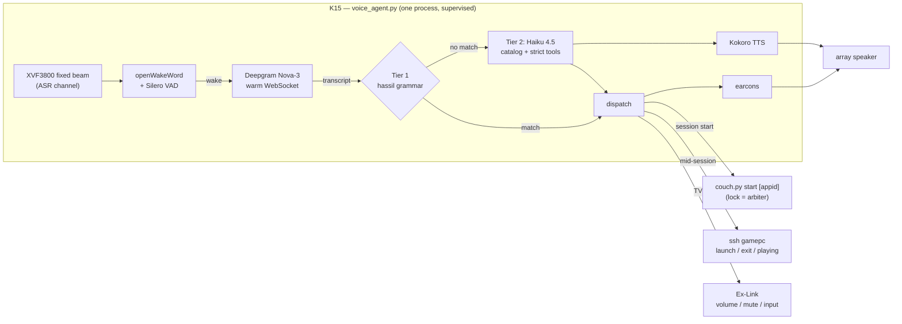

# Voice Control (Project C) — v1 design

**Status: design complete, nothing built. Next action: order the mic array, run C0.**

This supersedes the v0 sketch. It is the product of a research pass on 2026-08-10 —
five parallel deep-dives (wake word + mic array, STT, Steam indexing/launch, LLM
harness + TTS, pipeline prior art + Ex-Link) with load-bearing claims verified
against primary sources, cited inline. Two ideas from v0 got a promotion: the
assistant is no longer a thin intent-parsing fallback but a first-class product
(library Q&A, recommendations, launches), and the library index is the shared
foundation that feeds all three consumers (STT keyterms, Tier-1 fuzzy matching,
the assistant's context).

## What survived v0, what changed

| Area | v0 said | v1 verdict |
|---|---|---|
| Wake word | openWakeWord | **Confirmed — now by necessity.** Porcupine's free tier was [terminated 2026-06-30](https://community.home-assistant.io/t/fyi-picovoice-confirmed-free-tier-accesskeys-will-stop-working-after-june-30-2026/1012744) (keys disabled, SDK refuses to run). oWW is the only mature license-clean option; on Windows it installs onnxruntime-only (no tflite pain). It's in maintenance mode (last release Feb 2024) — pin versions; [sherpa-onnx KWS](https://github.com/k2-fsa/sherpa-onnx) is the no-training fallback. |
| STT | Deepgram Nova-3, ~$0.46/mo | **Confirmed, cheaper, three corrections.** Now [$0.0048/min](https://deepgram.com/pricing) streaming. (1) **Keyterms are capped at 500 tokens/request** ([docs](https://developers.deepgram.com/docs/keyterm)) — the whole library can't ride along; we curate ~40 titles. (2) A **warm WebSocket is $0** — KeepAlive costs nothing ([Deepgram staff, on the record](https://github.com/orgs/deepgram/discussions/1423)), killing connect latency on wake. (3) The listed price assumes your living-room audio trains their models; `mip_opt_out=true` doubles the rate to a still-trivial ~$2/mo — take it. |
| Intent Tier 1 | regex + fuzzy | **Upgraded to [hassil](https://github.com/OHF-Voice/hassil)** (Home Assistant's template intent matcher — pip-installable, pure Python) + rapidfuzz over titles. Stolen from VoiceAttack: per-command confidence thresholds — risky commands demand stricter matches than benign ones. |
| Intent Tier 2 | Haiku fallback, `{action, target}` | **Promoted to the product.** Full catalog inlined in context (validated pattern: [home-llm](https://github.com/acon96/home-llm/blob/develop/docs/Model%20Prompting.md)), strict tools for actions, spoken answers. Structured outputs are GA — `strict: true` tool use guarantees well-formed appids. |
| Hardware | XVF3800, ~$45 | **Confirmed at [$60.99](https://www.seeedstudio.com/ReSpeaker-XVF3800-USB-Mic-Array-p-6488.html).** Fixed-beam mode exists with exact commands (below). Two known firmware bugs with workarounds (below). Windows needs a one-time Zadig WinUSB driver for the control interface. |
| Dispatch | `launch` + `games` verbs | Confirmed, plus a third read-only verb: `playing` (the `RunningAppID` registry value — verified live). One behavioral gotcha: Steam **stacks** a second game on top of a running one, so `launch` must refuse when a different game is running. |
| Index refresh | nightly | **Replaced.** Nightly assumes the PC is awake at night — it isn't. Installed-games harvest happens at session boundaries (when the PC is provably awake); owned/metadata layers come from web APIs and need no PC at all. |

## System shape



- **One process** (`voice_agent.py`), desktop-dwelling like its siblings, its own
  supervisor (`Start-Voice.bat`, same restart-loop pattern as the listener), its
  own console. Deliberately a *separate* process from `chord_listener.py`: voice
  is an overlay and must never be able to take the load-bearing chord down with it.
  Research verdict: skip the Wyoming service mesh — its satellite layer is
  [archived and Linux-only](https://github.com/rhasspy/wyoming-satellite); import
  the libraries directly. (Closest prior art for our Tier-1 thesis:
  [Speech-to-Phrase](https://www.home-assistant.io/blog/2025/02/13/voice-chapter-9-speech-to-phrase/).)
- **The overlay rule (unchanged from v0):** every voice command has a non-voice
  path (chord, tile, hotkey, remote). No requirement may depend on the mic working.
- The mic is K15-local USB — VirtualHere only shares the Puck, so voice reaches
  the K15 **in every system state**, including mid-session when the Puck is claimed
  and the chord is deaf.
- Logs: `[voice]` tag into `couch.log` via `cglib.make_log` — one place to look
  stays true.

## The pipeline, stage by stage

### Capture — XVF3800, fixed beams at the couch

Firmware/config (all commands verified against the
[XVF3800 user guide v3.2.1](https://www.xmos.com/documentation/XM-014888-PC/pdf/xvf3800_user_guide_v3.2.1.pdf)
and present in Seeed's Windows `xvf_host.exe` from the
[reSpeaker repo](https://github.com/respeaker/reSpeaker_XVF3800_USB_4MIC_ARRAY)):

- **USB (UA) firmware**, default 2-channel 16 kHz build: L = comms-processed,
  **R = ASR beam output — the channel we consume** for both wake and STT.
- One-time Windows setup: UAC2 audio is driverless; the control/DFU interface
  needs Zadig WinUSB once.
- Fixed-beam aim (v0's "exact parameter names" open question — resolved):
  `AEC_FIXEDBEAMSONOFF 1` (both beams must be fixed — you can't fix just one),
  `AEC_FIXEDBEAMSAZIMUTH_VALUES` + `AEC_FIXEDBEAMSELEVATION_VALUES` (radians;
  aim beam 0/1 at couch-left/couch-right, elevation slightly up from the low
  console), `AEC_FIXEDBEAMSGATING 1` (only the speech-hot beam active). With
  fixed mode on, auto-select is constrained to the two fixed beams — v0's other
  open question, also resolved.
- Validation readouts: `AEC_AZIMUTH_VALUES`, `AEC_SPENERGY_VALUES` (per-beam
  speech energy — the directional-VAD double-gate from v0 is real),
  `LED_EFFECT 4` (DoA mode) while speaking from the couch.
- Persistence: `SAVE_CONFIGURATION 1` — **but** a corrupted save can
  [brick USB enumeration](https://github.com/respeaker/reSpeaker_XVF3800_USB_4MIC_ARRAY/issues/8)
  (recovery: Safe Mode, hold mute at boot). Rule: bench-test the full config
  live, save once, know the recovery chord first.
- Known bug #2: the array can
  [hang after a host reboot](https://forum.seeedstudio.com/t/respeaker-xvf3800-hangs-after-computer-reboot/294782)
  (VBUS never drops). Mitigation: `xvf_host REBOOT 1` once at K15 boot —
  `Start-Voice.bat` runs it before the supervisor loop, exactly where
  `reconcile` sits in `Start-Listener.bat`.
- **Audio out**: 3.5 mm stereo + 5 W amplified speaker connector, enumerates as a
  UAC2 playback device. All earcons and TTS play here — independent of what input
  the TV is on, and routing our own output through the array is what makes its
  AEC legitimately applicable (it can never cancel the TV; that's the beam's job).

### Wake word — openWakeWord on onnxruntime

- Start with pretrained **`hey jarvis`** + Silero `vad_threshold`; tune
  `threshold`/`trigger_level` against real movie audio. Train a custom
  **"hey console"** model later (Colab, ~1–2 hrs, synthetic Piper data) — C0
  data decides whether it's needed; pretrained models often slightly beat
  first-attempt customs.
- Cost: 15–20 models run real-time on one RPi3 core — one model on the K15's
  Core Ultra 5 125U is noise.
- Double-gate (v0 bonus, confirmed feasible): wake fires only if openWakeWord
  triggered AND `AEC_SPENERGY_VALUES` shows the couch beam hot — rejects wake
  words shouted by the movie from the TV's azimuth.

### STT — Deepgram Nova-3, warm socket, curated keyterms

Connection (params verified against current docs):

```
wss://api.deepgram.com/v1/listen?model=nova-3&language=en&smart_format=true
  &interim_results=true&endpointing=300&utterance_end_ms=1000&vad_events=true
  &mip_opt_out=true&encoding=linear16&sample_rate=16000&channels=1
  &keyterm=...×40
```

- **Warm socket**: prime with a short silence buffer at connect (KeepAlive alone
  won't hold a never-fed socket), then KeepAlive text frames every 5 s. Idle cost
  $0; reconnect logic stays anyway (10 s no-audio timeout, NET-0001).
- **End-of-command**: fire on `speech_final` OR `UtteranceEnd`, whichever first.
  `utterance_end_ms` (word-timing gaps) is load-bearing, not optional — silence-VAD
  endpointing is defeated by TV/game audio. Hard window cap 8 s, then `Finalize`.
- **Keyterms**: ≤500 tokens total → curated ~40 titles = installed games sorted by
  recency + newest installs, rebuilt at each index refresh, applied on reconnect.
  (+$0.0013/min metered add-on.)
- Privacy: `mip_opt_out=true` always (audio not retained for training; ~2× price,
  still ~$2/mo). Audio leaves the K15 only between wake and endpoint; transcripts
  are logged, audio never stored.

### Intent Tier 1 — deterministic grammar (hassil + rapidfuzz)

Templates (hassil YAML syntax), expected to absorb ~90% of utterances:

| Utterance family | Action | Rigor |
|---|---|---|
| `(play\|launch\|start\|put on) {game}` | fuzzy title→appid → launch flow | rapidfuzz `token_set_ratio ≥ 87` against installed titles; below → Tier 2 |
| `start [a\|the] session` / `game time` | `couch.py start` | template match |
| `end [the] session` / `we're done` | `ssh gamepc exit` | **exact template only, no fuzz** — the VoiceAttack lesson: risky commands earn stricter thresholds |
| `volume up/down` / `[set] volume to {n}` / `mute` | Ex-Link | template; absolute set clamped to `volumeMax` |
| `switch to (apple tv\|playstation\|ps5\|the pc)` | Ex-Link input | template |
| anything else | → Tier 2 | — |

### Feedback — earcons speak the same language as the thuds

Tier-1 acks are pre-synthesized WAV tones (generated in code at startup — no
binary assets in the repo), played instantly from the array speaker. **Count is
the message, same vocabulary as the haptics:** 1 tone = accepted/launching,
2 = busy, 3 = failed. A short tick acknowledges wake ("listening"). TTS is
reserved for Tier-2 answers — Tier-1 must never wait on a synth.

## The assistant (Tier 2) — the part that got promoted

### The library index — one foundation, three consumers

Three layers, merged into `state/library.json` (atomic temp-write + `os.replace`;
JSON over SQLite deliberately — hundreds of rows, the assistant inlines the whole
catalog anyway, and flat files match the repo's debuggability idiom):

| Layer | Source | Needs | Refresh |
|---|---|---|---|
| **Installed** | `ssh gamepc games` → new Dispatch verb reads `libraryfolders.vdf` + every `appmanifest_*.acf`, returns JSON (appid, name, size, LastPlayed, state) | PC awake | At session boundaries — right after READY and at session end, when the PC is provably awake — plus opportunistically at voice-agent start if reachable. **Never a nightly schedule against a sleeping PC.** |
| **Owned + playtime** | Steam Web API `IPlayerService/GetOwnedGames` (`include_appinfo`, `include_played_free_games`) → `playtime_forever`, `playtime_2weeks`, `rtime_last_played` | API key + steamid64, no PC | Daily. (100k calls/day ToS cap; we use 1.) |
| **Metadata** | `store.steampowered.com/api/appdetails` (genres, categories — **id 28 = full controller support, 18 = partial** — short_description, metacritic, release date) + [SteamSpy](https://steamspy.com/api.php) tags with vote counts | nothing | New appids only, ≤1 req/2 s (appdetails' unofficial ~200/5 min ceiling; SteamSpy 1 req/s), cached forever. |

Data-quality rules learned in research: the three last-played sources disagree —
**Web API `rtime_last_played` is canonical** for recency/playtime (ACF `LastPlayed`
is per-machine, `localconfig.vdf` is stale until Steam flushes); ACFs are canonical
only for *what is installed*. Steam's official genres are uselessly coarse
("Action, Indie") — **SteamSpy tag vote-counts drive the recommendation
vocabulary** ("mecha", "roguelite", "short").

`library.py` owns all of this (CLI: `refresh`, `show`); `voice_agent.py` owns the
schedule. The index feeds three consumers: Deepgram keyterms, Tier-1 title
matching, and the assistant's catalog.

### Harness — Messages API, catalog in context, strict tools

Verdict from research: the Claude Agent SDK is overkill for a 3-tool appliance;
plain `anthropic` SDK with the beta tool runner (or a 30-line manual loop).
**Model: `claude-haiku-4-5`** ($1/$5 per MTok, TTFT ~0.6–0.9 s).

- **Catalog inlined in the system prompt**, home-llm compact-row style, one line
  per game: `appid | title | top-5 tags | hours | last-played | installed | controller`.
  ~15–30 tok/game → 6–18K tokens for a few hundred games — single-request answers,
  no retrieval round-trips. `short_description` stays out of the rows (token bloat);
  a drill-down tool covers it.
- **Tools** (all `strict: true` — structured outputs are GA, malformed appids
  impossible): `launch_game(appid)`, `get_game_details(appid)`,
  `get_now_playing()`, `control(action)` where action ∈ {end_session,
  start_session, volume_up, volume_down, set_volume, mute, switch_input} — the
  same action space as Tier 1, so garbled-but-clear commands still land.
  Belt-and-braces: `launch_game` re-validates the appid against the index before
  dispatch; the model never fabricates a launch target.
- **Prompt caching: mostly skip.** Haiku 4.5's cache minimum is 4,096 tokens and
  the 5-min TTL expires between couch queries — one free `cache_control`
  breakpoint after the catalog (pays off inside multi-turn follow-ups), nothing
  architected around it.
- **Conversation model**: stateless per wake, except the last exchange is kept
  for 60 s so "launch the second one" resolves. A hands-free follow-up window
  (mic reopens ~8 s after an answer, no wake word) is C4.
- **Voice out**: **Kokoro-82M via kokoro-onnx** (Apache 2.0, near-real-time on
  the 125U, clearly better prosody) with Piper (`piper-tts`, now GPL, Windows
  wheel) as the lighter fallback. Stream the Haiku response and start synthesis
  at the first sentence boundary. Deepgram Aura-2 ($0.030/1K chars, key already
  on hand) is the zero-effort cloud upgrade if local quality disappoints.

**Budgets** (post-utterance): Tier-1 command ≈ ≤1.5 s to action. Tier-2 answer:
STT final ~0.3–1 s → Haiku TTFT ~0.7 s → first sentence ~0.5 s → Kokoro ~0.5–1 s
→ **speech starts ~2–3.5 s**. Cost ~$0.012/query, ~$3–4/mo at 10 queries/day.

### Example flows

- *"hey console — play armored core 6"* (PC asleep): wake tick → Tier-1 fuzzy hit
  → 1-tone earcon → `couch.py start 1888160` → existing rails (Ex-Link power, WoL,
  enter, READY, input switch — the one rule intact) → after the switch, couch.py
  dispatches `ssh launch 1888160` → game boots into Big Picture.
- *"what mech games do I have?"* (any state): Tier-2 → Haiku scans inline catalog
  tags → spoken answer, no tools invoked.
- *"suggest a shooter I haven't played in a while"*: Tier-2 → tags × `hours` ×
  `rtime_last_played` reasoning → spoken suggestion → "want it?" is a follow-up
  ("play it" within 60 s resolves via kept context).
- *"end session"* mid-game: Tier-1 exact match → `ssh gamepc exit` → existing
  teardown. The v0 exit asymmetry, closed.

## Dispatch fan-out — host-side changes (C2)

`Dispatch.ps1` grows from three verbs to six; the posture (allowlist, forced
command, dependency-free, everything else DENIED) is unchanged:

| Verb | Behavior | Notes |
|---|---|---|
| `games` | Read `libraryfolders.vdf` + ACFs, emit compact JSON | Inline (~20 lines, built-ins only: Get-Content/regex/ConvertTo-Json). Read-only. |
| `launch <appid>` | Validate `^\d{1,10}$` → refuse `NOTREADY` unless the ready marker exists → read `RunningAppID`; if another game runs, return `BUSY:<appid>` → else write appid to `C:\ProgramData\CouchGaming\launch-app`, `schtasks /Run \CouchGaming\LaunchGame`, `OK`/`FAILED:<code>` | File-as-argument because the task needs the interactive session; the pre-checks live in Dispatch so failures return synchronously. |
| `playing` | Emit `HKCU\Software\Valve\Steam\RunningAppID` (0 = none) | Verified live signal. Read-only. |

`Launch-Game.ps1` (new, task `\CouchGaming\LaunchGame`, registered with the same
idiom as Enter/Exit including the load-bearing 5-minute execution limit): read +
delete the marker file, re-validate numeric, `& "$SteamPath\steam.exe" -applaunch <appid>`
(`-applaunch` over the URI: passes args, no protocol-handler dependence; launches
into the already-running Big Picture session cleanly).

**Deliberate refusal**: no force-switch. Steam stacks a second game rather than
closing the first, and there is no steam:// close — ending a game remotely means
taskkill, which eats unsaved progress. v1 answers "play Y" during X with *"X is
running — quit it first."* A confirmed-kill flow is a C4 question, not a default.

`couch.py` delta: `start` accepts an optional appid; after the input switch it
dispatches `ssh launch <appid>` best-effort (a failed game launch is logged but
never fails the session — Big Picture is already up, which is a working outcome).
The chord path passes no appid and is byte-for-byte today's behavior. During a
voice-initiated launch, `voice_agent` watches `state/last_error` (read-only,
mtime-tracked — the chord listener stays the sole consumer) and *speaks* launch
failures; the 3-thud haptic still fires for chord users.

## Ex-Link additions (C1)

New frames from Samsung's official
[RS-232 control worksheet](https://image-us.samsung.com/SamsungUS/samsungbusiness/tv-ci-resources/Samsung-RS232-Control.pdf)
(QLED-era doc; matches our frame format and the `03 0c f1` ack we already observe).
Fixed frames join `EXLINK_FRAMES` pre-computed; volume-set is parametric so
`cglib` gains a checksum builder — **frames are computed, never hand-typed**
(a one-byte slip in this family is `power_off`):

| Command | Frame | Confidence |
|---|---|---|
| `vol_up` | `08 22 01 00 01 00 d4` | High (official + 3 independent sources) |
| `vol_down` | `08 22 01 00 02 00 d3` | High |
| `mute_toggle` | `08 22 02 00 00 00 d4` | High. **Discrete mute on/off does not exist** — mute state is tracked in software, re-synced via absolute volume set. |
| `vol_set <0-100>` | `08 22 01 00 00 <vv> <cs>` | High (worksheet: "Volume Direct") |
| status queries (`F0 ..`) | volume/mute/power/source | Contested on modern sets — one bench attempt at C1 (500 ms read timeout); if the S90C answers, the mute-desync problem dissolves; if not, software state. |

Validation drill (Stage-5 style, C1 gate): each frame sent once from the frozen
table, expect the 3-byte success ack, TV observed. Never send key-codes `0x3B`/`0x3C`
(factory/service menu).

## Config, secrets, supervision, doctor

- `config.json` gains a `voice` section: array device-name fragment, wake model +
  threshold, keyterm count, `volumeStep` (default 5), `volumeMax` (default 40 —
  a voice command should not be able to blast the room), busy/confidence knobs.
- **`secrets.json` (new, gitignored, with a committed `secrets.template.json`)**:
  `deepgramApiKey`, `anthropicApiKey`, `steamApiKey`, `steamId64`. Same posture as
  VirtualHere's `config.ini`: credentials never enter the repo. `.gitignore` grows
  one line.
- `Start-Voice.bat`: `xvf_host REBOOT 1` + array-settle delay once at boot (outside
  the loop, like `reconcile`), then the same restart-with-backoff supervisor as the
  listener. Startup-folder shortcut, console closable to stop.
- `doctor.py` grows voice checks (C1): array audio device present + control
  interface answers, secrets keys present, Deepgram auth ping, wake model file,
  library index age. Same PASS/WARN/FAIL + remedy format.
- New Python deps (K15 only): `sounddevice`, `openwakeword` + `onnxruntime`,
  `deepgram-sdk`, `hassil`, `rapidfuzz`, `anthropic`, `kokoro-onnx` (C3). No new
  PC-side dependencies — the PC stays PowerShell-built-ins-only.

## How voice obeys the house rules

- **The one rule** is untouched: voice never switches the TV input to HDMI 4 —
  only `couch.py` does, after READY, exactly as today.
- **The lock is the arbiter**: voice "start/play" checks `cglib.lock_age()` like
  the chord does — fresh lock → busy earcon, no double launch. `couch.py start`
  remains the single owner of the launch sequence.
- **Teardown wins**: "end session" mid-launch just works — Exit stops a mid-flight
  Enter (the existing guard). Known wart, accepted: couch.py's abandoned launch
  then reports "failed" (3 thuds / spoken) when the truth is "cancelled" — wrong
  word, right outcome, TV untouched.
- **Safety stands down**: voice adds no new writers to display topology or the
  Puck. The mic is never VirtualHere-shared; voice reaches the K15 in every state.
- **Attack surface**: three new SSH verbs, all allowlisted, one write-ish
  (`launch`, double-validated numeric, refuses outside READY). No inbound network
  surface on the K15 — voice is outbound WebSockets only.

## Phases — each independently shippable, riskiest unknown first

**C0 — Acoustic acceptance gate** *(hardware: $60.99 + shipping; no code)*
Mount per v0's placement ranking → Zadig → fixed-beam config (commands above) →
aim validated with `AEC_SPENERGY_VALUES` + LED DoA while speaking from the couch →
`SAVE_CONFIGURATION` once, recovery chord known first. **Gate: ≥18/20 wake-word
trials ("hey jarvis", gain-tuned) from the couch at real movie volume, ≤1 false
accept per 2-hour movie, per candidate placement.** The double-gate (beam energy)
may be enabled if the raw rate disappoints. This gate decides placement and
whether the TV/couch azimuth separation is sufficient — the single biggest risk
in the project (AEC cannot cancel the TV; only geometry can).

**C1 — Core commands** *(K15 only; zero PC changes)*
`voice_agent.py` (capture → wake → warm-socket STT → Tier-1 → dispatch), earcons,
Ex-Link volume/mute frames + validation drill + query-support bench test,
`Start-Voice.bat`, secrets scaffolding (Deepgram key only), doctor rows.
Commands: start/end session, volume/mute, input switching. Full daily utility.
Optionally: train "hey console" (Colab) if C0's pretrained false-accept rate irks.

**C2 — Game launch** *(first PC-side change)*
`games`/`launch`/`playing` verbs, `Launch-Game.ps1` + task registration,
`library.py` layer 1 (installed), `couch.py` optional appid, Tier-1
`play {game}` with keyterm curation. Drills: "play X" cold (full flow into the
game), "play X" mid-session, "play Y" during X (refusal message), fuzzy-title
torture ("armored core", "AC6", "the mech one" → Tier-2 when built).

**C3 — The assistant**
Layers 2+3 (Steam key + metadata crawl), Haiku harness + strict tools, Kokoro
TTS, 60-s follow-up memory, "what am I playing". Drills: mech-games query,
suggest-a-shooter, launch-the-second-one, "end session" phrased weirdly.

**C4 — Menu, not commitments**: hands-free follow-up window · voice-initiated
install (`steam://install` + controller confirm on the TV) · HowLongToBeat
enrichment ("something short tonight") · confirmed force-switch of running games ·
controller-battery queries (0x43 reports — cross-project with the haptic work) ·
custom "hey console" model · **local STT fallback** (2026 changed this: NVIDIA
Parakeet-tdt-0.6b INT8 runs ~sub-0.1 RTF on CPU — a real offline option if
internet dependence ever bites, invalidating v0's "local = slow Whisper" premise).

## Costs

| Item | One-time | Monthly |
|---|---|---|
| ReSpeaker XVF3800 | $60.99 | — |
| Deepgram STT (opted out of data sharing) | $200 credit on signup | ~$2 nominal → **$0 for years on credit** |
| Claude Haiku 4.5 | — | ~$1–4 at 5–10 assistant queries/day |
| Wake word, TTS, index | — | $0 (all local) |
| **Total** | **~$61** | **≲$5, mostly $0 while credits last** |

## Risks & open questions

| Risk | Mitigation | Phase |
|---|---|---|
| TV and couch at similar azimuths from the console → beam rejection collapses | This *is* C0; placement ranking has two fallback positions; double-gate on beam energy | C0 |
| `SAVE_CONFIGURATION` brick bug | Test live before saving; save once; Safe-Mode chord documented | C0 |
| Array hangs after K15 reboot | `xvf_host REBOOT 1` in Start-Voice.bat, outside the loop | C1 |
| Ex-Link status queries unsupported on Tizen S90C | One 500 ms bench probe; fall back to software mute state + absolute volume re-sync | C1 |
| openWakeWord maintenance-mode | Pin versions; sherpa-onnx KWS as fallback engine | C1 |
| Hallucinated/typo'd appids from Tier-2 | `strict: true` tools + index re-validation before dispatch | C3 |
| Steam not running / logged out after PC reboot | `-applaunch` auto-starts Steam with the remembered account (15–60 s); verify Steam's own auto-start stays enabled on the PC | C2 |
| "Cancelled launch" reported as "failed launch" | Accepted wart; revisit only if it ever confuses | — |
| Wake latency vs. warm-socket drops | Reconnect-on-close + silence-prime; KeepAlive every 5 s | C1 |

## Rejected alternatives (and why)

| Alternative | Why not |
|---|---|
| Porcupine wake word | Free tier terminated 2026-06-30; SDK refuses to run unlicensed |
| Wyoming services / Rhasspy 3 | Satellite archived, Linux-assumed; we import libraries in-process (but keep its event vocabulary as internal interface names) |
| OVOS / Neon | Message-bus + skill ecosystem — architectural overkill for one fixed-purpose device |
| Local STT primary | U-class CPU: Whisper-turbo RTF ~0.5–1 misses the latency budget; cloud-primary stands (Parakeet noted for C4 fallback) |
| AssemblyAI streaming | Bills wall-clock socket-hours ($0.15/hr) — the warm-socket pattern would cost ~$108/mo vs Deepgram's $0 |
| Claude Agent SDK | Full Claude-Code harness; dead weight for 3 tools + an inlined catalog |
| RAG/embeddings over the library | A few hundred games fit in 6–18K tokens; retrieval adds latency and failure modes for nothing |
| SQLite index | JSON matches repo idiom, human-debuggable, atomic-replace writes; the whole catalog is inlined anyway |
| Force-switching running games | Unsaved-progress footgun; refusal + controller quit in v1, confirmed-kill at most in C4 |
| Voice navigation of menus / continuous conversation / load-bearing voice | v0 non-goals, unchanged |
