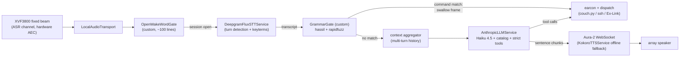

# Voice Control (Project C) — v2 design

**Status: BUILT AND SHIPPED (merged to `main` 2026-08-10).** C1–C3 are live on
the K15 — wake word, command grammar, game launch, and the conversation lane —
and this document stands as the as-designed record: the *why* behind the
architecture, the alternatives weighed, the costs and risks. Where the build
deviated, [voice-assumptions.md](voice-assumptions.md) is authoritative (it
carries the live verdicts); drills live in
[voice-testing.md](voice-testing.md). Still ahead: **C0**, the acoustic gate,
which waits on the mic array (bring-up procedure is in the testing guide), and
the C4 menu below — options, not commitments.

v2 supersedes the v1 design (git `36d5fa5`) after the UX requirements were elevated:
the assistant must support **multi-step conversational Q&A with a natural spoken
voice** and **structured tool calls**, both at minimal latency. v1's "one-shot
commands only, dialogue is a non-goal" stance is deliberately reversed. Product of
a second research pass on 2026-08-10 (four deep-dives: Deepgram Voice Agent API +
Flux, OpenAI Realtime 2.1, TTS landscape, orchestration frameworks); load-bearing
claims verified against primary sources, cited inline. v1's research (wake word,
mic array, Steam indexing, library/index design, dispatch fan-out, Ex-Link) is
carried forward unchanged where still valid.

## What v2 changes

| Area | v1 | v2 verdict |
|---|---|---|
| UX model | One-shot commands; dialogue non-goal | **Conversational sessions**: one wake word opens a session; multi-turn Q&A with mic re-opening after each answer; barge-in; deterministic commands still work at every point |
| STT | Nova-3, warm socket held 24/7, `utterance_end_ms` endpointing | **[Deepgram Flux](https://developers.deepgram.com/docs/flux)** — turn detection fused into the ASR model (−200–600 ms vs VAD pipelines, ~30% fewer false barge-ins), `EagerEndOfTurn` for speculative LLM starts with `TurnResumed` cancel, keyterms carry over. Warm-socket pattern dies (Flux v2 has [no $0-idle KeepAlive](https://github.com/deepgram/deepgram-python-sdk/issues/649)) → **wake-gated sessions** |
| TTS | Kokoro-82M local primary | **[Deepgram Aura-2](https://developers.deepgram.com/docs/tts-websocket-streaming) primary** (WebSocket streaming, 150–250 ms TTFA measured, beats ElevenLabs on *naturalness* in the assistant register — the dimension a 5 W speaker actually reproduces), **Kokoro demoted to offline fallback** |
| Orchestration | Hand-rolled single process | **[Pipecat](https://github.com/pipecat-ai/pipecat)** (BSD-2, v1.7.x, weekly releases): first-party services for our exact stack — `DeepgramFluxSTTService`, `AnthropicLLMService` (tools + streaming + prompt caching), Aura/`KokoroTTSService`, Silero VAD, [smart-turn v3](https://www.daily.co/blog/announcing-smart-turn-v3-with-cpu-inference-in-just-12ms/) (12 ms CPU semantic end-of-turn) — plus the interruption/turn-taking plumbing that is the genuinely hard 20% |
| Brain | Haiku 4.5, one-shot | Unchanged model + strict tools + inline catalog — but now a **conversation**: Pipecat context aggregation holds multi-turn history, and prompt caching finally pays (in-session follow-ups hit the 5-min TTL at 0.1×) |
| Conversation memory | Last exchange kept 60 s | In-session history native; the 60 s cross-session carry stays |

Everything else — XVF3800 fixed-beam capture, openWakeWord, the three-layer library
index, Dispatch verbs (`games`/`launch`/`playing`), `couch.py start [appid]`,
Ex-Link volume/mute frames, secrets posture, the house invariants — **carries over
from v1 unchanged** (sections retained below).

## Requirements (v2, made precise)

1. **Conversational Q&A** — multi-step exchanges about the library ("what mech
   games do I have?" → "which is shortest?" → "play it"), spoken answers in a
   natural voice, no wake word needed for follow-ups within a session.
2. **Structured tool calls** — launches, session control, TV control invoked from
   conversation with schema-guaranteed arguments (a hallucinated appid must be
   structurally impossible).
3. **Minimal latency** — targets: deterministic command ≤ 0.5 s end-of-speech →
   action; conversational reply ≤ 1.5 s end-of-speech → first audio; barge-in
   response < 150 ms.
4. Unchanged from v1: voice is an overlay, never load-bearing; the one rule; the
   lock is the arbiter; audio leaves the K15 only after wake.

## The architecture

One Pipecat pipeline, one process (`voice_agent.py`), supervised by
`Start-Voice.bat` exactly as v1 planned. Two custom frame processors carry the
whole product logic; everything else is a first-party service.



- **`OpenWakeWordGate`** (we write): consumes raw audio frames, runs the oWW ONNX
  model continuously, and gates the rest of the pipeline. Closed = nothing flows,
  no cloud, no Flux socket. On wake: open the session and *arm* the chime — it
  plays when you stop talking, never over your command (assumptions row 6).
  (Pipecat has
  [no first-party oWW audio plugin](https://github.com/pipecat-ai/pipecat/issues/1985);
  its transcript-level `WakePhraseUserTurnStartStrategy` informs the session
  semantics but the audio gate is ours.)
- **`GrammarGate`** (we write): a [custom FrameProcessor](https://docs.pipecat.ai/guides/fundamentals/custom-frame-processor)
  between STT and the context aggregator. On a Tier-1 match it **swallows the
  transcription frame** — the LLM never runs — plays the earcon, and dispatches.
  On no match, the frame flows through to the conversation lane. This runs on
  *every* final transcript, so deterministic commands stay deterministic **inside**
  conversations too ("volume up" mid-chat never touches the model).
- Everything else is configuration: Flux with curated keyterms, Anthropic service
  with the inline catalog + strict tools, Aura-2 over WebSocket with
  sentence-chunked streaming, Silero VAD for barge-in detection (hardware AEC on
  the array is the first line — it cancels our own speaker from the mic signal).

## The interaction model

```
DORMANT ──wake word──▶ SESSION OPEN (Flux connects, LED on; wake chime armed,
  ▲                        │            played when you stop talking)
  │                        ▼ per final transcript
  │                   GrammarGate
  │                   ├─ command match ──▶ dispatch + earcon (a success still
  │                   │                     inside the wake chime folds into
  │                   │                     it) ──▶ LINGER (~5 s, chained) ──▶ DORMANT
  │                   └─ no match ──▶ THINKING (Haiku, streaming)
  │                                        │ first sentence boundary
  │                                        ▼
  │                                   SPEAKING (Aura-2; mic open, barge-in armed)
  │                                        │ speech ends          │ user interrupts
  │                                        ▼                      ▼
  │                                   HOLDING (mic open, ~8 s) ◀──┘ (flush + truncate context)
  │                                        │ user speaks → route through GrammarGate again
  └──── timeout / exit phrase ─────────────┘
              (sleep chime — the wake chime's fifth, descending)
```

Rules of the model:

- **One wake word per session, not per utterance.** Follow-ups ("which is
  shortest?", "play it") need no wake word while HOLDING.
- **Tier-1 always screens first.** Commands are deterministic at every state —
  wake, mid-conversation, during LINGER. Exit phrases ("thanks", "that's all",
  "never mind") are Tier-1 templates that end the session; the sleep chime that
  follows is the same one the idle timeout plays, so every ending sounds alike.
- **Barge-in**: user speech during SPEAKING → kill playback, flush the TTS socket,
  cancel the LLM stream, truncate the assistant turn in context to what was
  actually spoken (Pipecat's interruption frames do this), treat the new speech as
  the next turn. Guards against TV speech: hardware AEC + beam first, then a
  min-words ≥ 2 / ~250 ms sustained-speech strategy and an energy floor —
  Pipecat's turn-start strategies implement exactly these.
- **Eager end-of-turn speculation**: Flux `EagerEndOfTurn` (threshold ~0.5) fires
  150–250 ms before confirmed end-of-turn → run GrammarGate immediately (free);
  on no match, start the Haiku call speculatively; `TurnResumed` cancels it. Costs
  [50–70% more LLM calls](https://deepgram.com/learn/introducing-flux-conversational-speech-recognition)
  — pennies at Haiku prices with caching, bought back as user-facing latency.
- **Tool calls end or continue sessions naturally**: `launch_game` speaks its
  confirmation ("Launching Armored Core VI") and drops to DORMANT; a Q&A answer
  holds the mic open for the next question.
- **Feedback vocabulary unchanged**: earcons (count-coded, matching the haptic
  thuds) for Tier-1 acks; the natural voice is reserved for the conversation lane.
- **Session memory**: full history within a session (native); last exchange
  carried 60 s across sessions so "hey console — play the second one" still works
  after a session closed.

## Stage decisions (deltas from v1 only)

### STT — Deepgram Flux, wake-gated sessions

`wss://api.deepgram.com/v2/listen?model=flux-general-en`, linear16/16 kHz, 80 ms
chunks, `eot_threshold` ~0.7, `eager_eot_threshold` ~0.5, keyterms = the same
curated ~40 titles from the index. $0.0065/min. The v1 warm-socket design is
retired: Flux sockets die ~20–30 s after audio stops and idle streaming is billed,
so the socket opens at wake and closes at DORMANT — which matches the session
model anyway. Wake-to-connect adds ~200 ms once per session, masked by the tick
earcon. Nova-3 remains configured as a fallback STT (Pipecat makes the swap one
line) if Flux's model coverage disappoints; [smart-turn v3](https://huggingface.co/pipecat-ai/smart-turn-v3)
(12 ms CPU, bundled with Pipecat) is the no-extra-vendor turn-detection fallback.

### Brain — unchanged, now genuinely conversational

Haiku 4.5 via `AnthropicLLMService`: inline compact catalog (~6–18K tokens),
strict tools (`launch_game`, `get_game_details`, `get_now_playing`, `control`),
client-side re-validation of appids against the index. What changes is the
economics and shape: multi-turn history is native (Pipecat's context aggregators
handle tool-call results in-history), and **prompt caching now pays** — follow-up
turns inside a session land well inside the 5-min TTL, re-reading the catalog at
0.1×. The cache breakpoint after the catalog block goes from "free but idle" to
load-bearing. Cross-vendor model choice stays deferred to the C3 A/B (the
Haiku-vs-Luna analysis, doc'd earlier, is unchanged by v2 — the harness still
treats the model as a config string).

### TTS — Aura-2 streaming, Kokoro offline fallback

Aura-2 over WebSocket (`aura-2-*-en` voices, audition at C3): measured
[150–250 ms first-audio](https://futureagi.com/blog/best-tts-providers-voice-agents-2026/),
$0.030/1K chars ≈ **$4/mo on the credit we already hold**, and blind tests rank
its assistant-register voices above ElevenLabs on *naturalness* — while the
premium engines' expressiveness edge lives exactly in the frequencies a 5 W
speaker discards. Sentence-chunked streaming from the LLM (Pipecat aggregates to
sentence boundaries natively). `KokoroTTSService` (first-party, local ONNX) wired
as the automatic offline fallback: same PCM path, $0, clears the not-robotic bar
(TTS Arena #2) at the cost of slower first-audio. ElevenLabs/Cartesia rejected on
subscription gates + masked quality delta; OpenAI TTS on measured 350–600 ms TTFB.

### Latency budgets (end-of-speech →)

| Path | Budget | Mechanism |
|---|---|---|
| Tier-1 command | **~0.3–0.5 s** to earcon + dispatch | Flux EOT ~260 ms + grammar <5 ms |
| Conversational first audio | **~1.0–1.5 s** (eager speculation: ~0.8–1.2 s) | EOT → Haiku TTFT 0.6–0.9 s → first sentence → Aura TTFA 0.15–0.25 s, all pipelined |
| Follow-up turns | same | session already warm; catalog cache-read |
| Barge-in | **< 150 ms** | VAD during SPEAKING → flush frames |

## What carries over from v1 (unchanged, normative)

- **Capture**: XVF3800 UA firmware, fixed beams at the couch
  (`AEC_FIXEDBEAMSONOFF 1`, azimuth/elevation values, gating), `SAVE_CONFIGURATION`
  once with the brick-bug caution, `xvf_host REBOOT 1` at boot, ASR channel
  consumed, speaker out through the array (which is what makes open-mic +
  barge-in work: the AEC's reference is our own output).
- **Wake word**: openWakeWord on onnxruntime, pretrained `hey jarvis` → custom
  "hey console" later; double-gate on beam energy available if C0 demands it.
- **Library index**: three layers (installed via `games` verb at session
  boundaries; owned/playtime via Steam Web API daily; metadata via appdetails +
  SteamSpy cached forever); feeds keyterms, grammar titles, and the catalog.
- **Dispatch fan-out**: `games` / `launch <appid>` (READY-gated, BUSY-checked) /
  `playing` verbs; `Launch-Game.ps1` + task; `couch.py start [appid]`; the
  refusal-not-force-switch policy.
- **Ex-Link additions**: vol_up/vol_down/mute_toggle/vol_set frames from the
  official worksheet, frozen table, computed checksums, bench validation drill,
  query-support probe, `volumeMax` clamp.
- **Config & secrets**: `secrets.json` (gitignored) + template — `deepgramApiKey`,
  `anthropicApiKey`, `steamApiKey`, `steamId64`; `config.json` `voice` section
  grows turn-taking knobs (`eotThreshold`, `eagerEotThreshold`, `holdWindowS`,
  `lingerS`, barge-in guards) alongside v1's.
- **House rules**: the one rule; the session lock as arbiter; teardown wins;
  voice adds no inbound network surface; the listener (haptic chord) remains a
  separate process and failure domain — voice still cannot take the chord down.
- **Doctor**: v1's voice checks plus a Pipecat pipeline smoke check (instantiate
  the pipeline headless, verify each service authenticates).

## Phases (revised)

**C0 — Acoustic acceptance gate** *(unchanged; hardware $60.99)*
Mount → Zadig → fixed-beam aim → wake trials at movie volume (≥18/20, ≤1 false
accept per 2-hour movie) → `SAVE_CONFIGURATION`. Decides placement and go/no-go.

**C1 — Pipecat spike + command lane** *(K15 only; can start before the array ships, using any USB mic)*
Day-1 gate: run Pipecat's foundational local-audio example on the K15 —
`LocalAudioTransport` (PyAudio) on Windows is community-tier, and this spike is
where we find out; the documented escape hatch is a thin `sounddevice` transport
(~200 lines), everything above it survives. Then: `OpenWakeWordGate` +
`DeepgramFluxSTTService` + `GrammarGate` + earcons; commands wired (session
start/end, volume/mute/input after the Ex-Link drill); `Start-Voice.bat`; doctor
rows; secrets scaffolding. **Deliverable: every v1 C1 command works by voice with
sub-second response.** Test drills: command latency stopwatch, chained commands in
LINGER, exit phrases, listener-coexistence (chord still works with voice running).

**C2 — Game launch** *(unchanged from v1)*
`games`/`launch`/`playing` verbs, `Launch-Game.ps1` + task, library layer 1,
`couch.py [appid]`, "play {game}" in the grammar, keyterm curation. Same drills.

**C3 — The conversation lane**
Index layers 2+3, catalog build, `AnthropicLLMService` with strict tools +
client-side appid validation, Aura-2 (voice audition first), HOLDING window,
barge-in guard tuning against real TV audio, eager-EOT speculation, exit-phrase
polish, Kokoro fallback path, 60 s cross-session carry, the model A/B (Haiku vs
current alternatives, measured end-of-speech → first-audio + answer quality).
Drills: mech-games multi-turn ("what mech games…" → "which is shortest?" →
"play it" — launch fires with a validated appid), barge-in mid-answer, "volume
up" mid-conversation (must be Tier-1, verify no LLM call in the log), TV-noise
false-turn soak during a movie.

**C4 — Menu, not commitments**
gpt-realtime-2.1 as a drop-in conversation-lane engine (the researched text-in →
audio-out pattern — see Rejected alternatives for why it lost v2 and what would
revive it) · voice-initiated install flow · HowLongToBeat enrichment ·
controller-battery queries · custom "hey console" model · smart-turn v3 swap if
Flux disappoints · Parakeet local STT fallback.

## Costs (monthly, at ~30 commands + ~15 conversational exchanges/day)

| Item | Cost |
|---|---|
| Flux STT (wake-gated sessions, ~5 min audio/day) | ~$1 |
| Aura-2 TTS (~150 chars × 30 responses/day) | ~$4 |
| Haiku 4.5 (conversation turns, cached catalog, incl. eager-EOT overhead) | ~$1–4 |
| Wake word, grammar, earcons, index, Kokoro fallback | $0 (local) |
| **Total** | **~$6–9 nominal — Deepgram items ride the $200 credit (years); net out-of-pocket ≈ $1–4 (Anthropic)** |

## Risks & open questions (v2 additions)

| Risk | Mitigation | Phase |
|---|---|---|
| Pipecat on Windows is community-tier (PyAudio/WASAPI quirks, Linux-first examples) | Day-1 spike on the K15 before any feature work; pin versions; `sounddevice` transport escape hatch | C1 |
| Flux idle billing + no $0 keepalive | Wake-gated sessions, aggressive close at DORMANT; tick earcon masks reconnect | C1 |
| WebSocket-TTS keeps synthesizing briefly after barge-in ([known Pipecat wart](https://github.com/pipecat-ai/pipecat/issues/950)) | Sentence-chunked sends bound the overrun; flush + truncate on interrupt | C3 |
| TV speech triggers false turns/barge-ins | Beam + AEC first line; min-words/sustained-speech/energy-floor turn-start strategies; C3 movie soak test | C3 |
| Eager EOT cost multiplier (+50–70% LLM calls) | Pennies at Haiku prices; disable via config if it ever isn't | C3 |
| Aura-2 voice disappoints in person | Audition all `aura-2-*` voices at C3 start; Cartesia/ElevenLabs are one-line Pipecat swaps if taste demands | C3 |
| Pipecat interruption regressions (fast-moving codebase) | Pin the version; upgrade deliberately with the C3 drill suite as the regression test | C3+ |

## Rejected alternatives (v2 round)

| Alternative | Why not |
|---|---|
| **Deepgram Voice Agent API** (managed STT→LLM→TTS) | The LLM answers every turn — no way to suppress the think stage, so our deterministic lane can only *race* it; managed prompt cap is 25K chars (the catalog doesn't fit); billed on wall-clock connection time including idle ($0.075–0.163/min) |
| **OpenAI gpt-realtime-2.1/mini as the conversation engine** | Clean fit *only* as text-in → audio-out (never stream it mic audio: no AEC over WebSocket, its VAD fights the wake gate) — but no strict tool schemas (validate-after), a second LLM vendor, the catalog re-billed per session (~$10.5/mo mini, ~$45/mo full; mini has credible tool-calling regression reports), and its headline wins (fused voice, duplex feel) are what Flux + Aura + streaming already approximate at ~$6/mo with strict tools intact. **Documented as the C4 upgrade path**: if measured C3 latency or voice quality disappoints, it drops into the GrammarGate fallback branch without touching wake, STT, or Tier-1 |
| **LiveKit Agents** | Room/WebRTC-server-centric; the local mode is explicitly a dev harness being deprecated into their CLI — wrong grain for a permanent single-box appliance |
| **Hand-rolled asyncio loop** | 2–4 weeks of underestimated plumbing (interrupt-safe context truncation, cancellation races, sentence chunking, tool-call loops mid-stream) that Pipecat ships and maintains; revisit only if the Windows spike fails badly — then steal its frame-cancellation and turn-strategy designs |
| **ElevenLabs / Cartesia TTS** | Subscription-gated at our volume ($22/mo tier / plan overrun); their quality edge is expressiveness, which the 5 W speaker masks — Aura-2 wins naturalness where it's audible, on a credit we already hold |
| **Kokoro as primary voice** | Clears "not robotic" but can't hit ≤300 ms first-audio on this CPU without micro-chunking contortions; demoted to offline fallback, not deleted |
| v1's one-shot-only UX | Superseded by requirements — this revision exists because of it |
| (v1 rejections — Porcupine, Wyoming, local-STT-primary, RAG, SQLite, Agent SDK, force-switch, etc.) | All stand; see git history `36d5fa5` for the v1 table |
