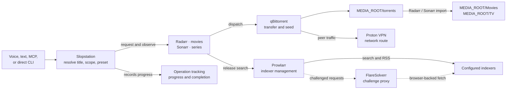

# Media acquisition on the K15

Slopstation converts a voice, text, MCP, or direct CLI request into durable
desired state in Radarr or Sonarr. Those services select releases, qBittorrent
transfers them, and Slopstation observes progress without owning the download
process.

## Architecture




Prowlarr, FlareSolverr, Radarr, Sonarr, the Homarr dashboard, and its Glances
stats feeder run in Docker Compose. qBittorrent and Proton VPN run natively on
Windows.

| Component | Owns |
|---|---|
| Slopstation | Title resolution, explicit scope, preset selection, operation tracking, announcements |
| Prowlarr | Indexer definitions, categories, RSS/search modes, and per-indexer seed limits |
| Radarr | Movie monitoring, quality decisions, download dispatch, import, and cleanup |
| Sonarr | Series/season/episode monitoring, quality decisions, download dispatch, import, and cleanup |
| qBittorrent | Peer transfer, progress, seeding, and stop action |
| Proton VPN | qBittorrent’s peer-network route and forwarded port |
| FlareSolverr | Browser challenges for tagged Prowlarr indexers |
| Homarr | Read-only LAN dashboard over the services above; owns no pipeline state |
| Glances | Volume-fill and resource numbers for Homarr's system widgets |

The Arr quality profiles own release policy. Slopstation selects a configured
profile name; it does not score release titles itself. Future monitored episodes
remain Sonarr desired state after the originating Slopstation operation ends.

## Storage and addresses

`Start-Media.ps1` maps one Windows media root to `/data` in Radarr and Sonarr.
That root is `MEDIA_ROOT` in `k15\media\.env` - written there, not in the
shell environment, and gitignored, so read the live value rather than assuming
one. `.env.example` starts it at `C:\Media`.

Below, `<MEDIA_ROOT>` stands for whatever that file currently says. Only the
host side of these pairs moves: the container paths are what Slopstation and
the Arr databases store, and they never change.

| Purpose | Value |
|---|---|
| qBittorrent download path | `<MEDIA_ROOT>\torrents` |
| Radarr root | `/data/Movies` → `<MEDIA_ROOT>\Movies` |
| Sonarr root | `/data/TV` → `<MEDIA_ROOT>\TV` |
| Prowlarr UI | `http://192.168.68.75:9696` |
| Radarr UI | `http://192.168.68.75:7878` |
| Sonarr UI | `http://192.168.68.75:8989` |
| qBittorrent UI | `http://192.168.68.75:8080` |
| Internal FlareSolverr | `http://flaresolverr:8191` |
| Internal Glances | `http://glances:61208` |
| Homarr UI | `http://192.168.68.75:8575` (host 8575: VirtualHere owns 7575) |

Every web UI binds LAN-wide so Homarr's dashboard links resolve from any
machine; each one requires a login, and the bootstrap firewall rules scope
them to LocalSubnet on the Private profile. `127.0.0.1` still works from the
K15 itself. FlareSolverr and Glances stay internal to the Compose network.
Never expose any of these to the internet.

## Bootstrap

### 1. Start the sidecars

Install Docker Desktop with Linux containers, then run from the repository
root:

```powershell
powershell -NoProfile -ExecutionPolicy Bypass -File .\k15\media\Start-Media.ps1
```

On first run the script copies `.env.example` to `.env`, generates Homarr's
`SECRET_ENCRYPTION_KEY`, creates the config and media directories, and starts
FlareSolverr, Prowlarr, Radarr, Sonarr, and Homarr. Review `.env` and set
`MEDIA_ROOT` before the first run. Complete the first-run authentication
prompt in each local UI.

### 2. Configure native qBittorrent and Proton

Run qBittorrent as a native Windows application; do not add it to Compose.

- Proton: WireGuard, P2P server, include-only split tunnel containing
  `qbittorrent.exe`, standard kill switch, LAN access, and port forwarding.
- qBittorrent peer interface: Proton’s interface; optional IP set to all
  addresses; UPnP/NAT-PMP disabled.
- Web UI: port `8080`, authenticated, listening where Docker can reach it, with
  localhost and subnet authentication bypass disabled.
- Default save path: `<MEDIA_ROOT>\torrents`.
- Categories: create `radarr` and `sonarr`.

Set `media.qbittorrentNetworkInterface` in `k15\config.json` to the exact
interface name qBittorrent reports.

### 3. Configure Prowlarr

Add the indexers you are authorized to use, then add both applications with
**Full Sync**:

| Application | Server URL |
|---|---|
| Radarr | `http://radarr:7878` |
| Sonarr | `http://sonarr:8989` |

Use each application’s API key from **Settings → General**. In the Prowlarr
sync profile, enable RSS, automatic search, and interactive search. Confirm
movie categories reach Radarr and TV categories reach Sonarr.

For an indexer that needs browser-challenge handling, add a FlareSolverr
indexer proxy at `http://flaresolverr:8191`, give it a tag, and apply the same
tag to that indexer. FlareSolverr is internal-only and cannot solve an
interactive CAPTCHA.

### 4. Configure Radarr and Sonarr

In both applications, enable Completed Download Handling and add native
qBittorrent at `host.docker.internal:8080` with its Web UI credentials.

| Application | Root | Category |
|---|---|---|
| Radarr | `/data/Movies` | `radarr` |
| Sonarr | `/data/TV` | `sonarr` |

Add this remote path mapping in each application:

| Host | Remote path | Local path |
|---|---|---|
| `host.docker.internal` | `<MEDIA_ROOT>\torrents` | `/data/torrents` |

Test the root, download client, and remote mapping before continuing.

### 5. Create quality profiles

Create every distinct profile name referenced by `moviePresets` and
`seriesPresets` in `k15\config.json`. The example configuration maps movie
defaults to Blu-ray/HDR/lossless-audio policy and offers explicit `1080p` and
`2160p` steering; series presets provide the corresponding TV profiles.

| Preset | Movie profile | Series profile |
|---|---|---|
| `default` | `Slopstation Blu-ray HDR TrueHD` | `Slopstation Series` |
| `1080p` | `Slopstation 1080p` | `Slopstation Series 1080p` |
| `2160p` | `Slopstation Blu-ray HDR TrueHD` | `Slopstation Series 2160p` |

Profiles own allowed qualities, upgrades, cutoffs, custom-format scores, and
minimum scores. A strict profile waits when no qualifying release exists.

### 6. Enable Slopstation

Copy the Radarr and Sonarr API keys into `k15\secrets.json`. Maintenance and
port synchronization additionally use the Prowlarr key and qBittorrent Web UI
password:

```json
"radarrApiKey": "...",
"sonarrApiKey": "...",
"prowlarrApiKey": "...",
"qbittorrentPassword": "..."
```

Copy the `media` object from `config.example.json` into `config.json`, set its
URLs, roots, profile mappings, qBittorrent username/interface, and managed
indexers, then set `enabled` to `true`.

### 7. Validate and start unattended operation

From `k15\agent`:

```powershell
.venv\Scripts\python tools\media.py status
.venv\Scripts\python tools\media.py profiles
.venv\Scripts\python tools\media.py validate
.venv\Scripts\python tools\media.py doctor
```

`validate` checks roots and exact profile names. `doctor` additionally checks
containers, APIs, health, indexers, download clients, cleanup policy,
qBittorrent’s VPN binding, categories, Web UI security, and Proton port sync.
Neither command adds a torrent.

For unattended use, configure Docker Desktop, Proton, and native qBittorrent
to start at login. Compose services use `restart: unless-stopped`.

### 8. Configure the Homarr dashboard

Homarr gives the gaming PC (or any LAN browser) a read-only view of the
pipeline, with click-through into each service's own UI.

Allow the web UIs once, from an elevated PowerShell:

```powershell
New-NetFirewallRule -DisplayName 'Homarr dashboard (LAN)' -Direction Inbound -Action Allow -Protocol TCP -LocalPort 8575 -Profile Private -RemoteAddress LocalSubnet
New-NetFirewallRule -DisplayName 'Media web UIs (LAN)' -Direction Inbound -Action Allow -Protocol TCP -LocalPort 9696,7878,8989 -Profile Private -RemoteAddress LocalSubnet
New-NetFirewallRule -DisplayName 'qBittorrent Web UI (LAN)' -Direction Inbound -Action Allow -Protocol TCP -LocalPort 8080 -Profile Private -RemoteAddress LocalSubnet
```

Open `http://127.0.0.1:8575`, complete onboarding, and create the admin user.
Then add the integrations. Use the K15's LAN address, not a container name:
Homarr polls it from inside Docker (NAT hairpin), and the same URL is what a
click on a calendar entry or app tile opens in the viewer's browser — a
container name would poll fine and 404 for every human. Glances is the
exception: nothing user-facing links to it, so it stays internal.

| Integration | URL | Credential |
|---|---|---|
| Radarr | `http://192.168.68.75:7878` | `radarrApiKey` |
| Sonarr | `http://192.168.68.75:8989` | `sonarrApiKey` |
| Prowlarr | `http://192.168.68.75:9696` | `prowlarrApiKey` |
| qBittorrent | `http://192.168.68.75:8080` | Web UI username and password |
| Glances | `http://glances:61208` | none |

Glances exists only to feed Homarr's system-resources and disk widgets. Its
drive gauges read the bind mounts under `/mnt` - the media root and the
config root's volume - so a moved media root changes what the dashboard
reports only through `MEDIA_ROOT` in `.env`, the same contract as the Arrs.
The Docker-containers widget instead reads the socket mounted into Homarr and
needs no integration.

Build a board (Sonarr/Radarr calendar, download queue, indexer health), then
mark it public in the board's settings. The root URL always redirects
anonymous visitors to the login page; only the direct board URL renders
without auth, so bookmark `http://192.168.68.75:8575/boards/<name>` on the
gaming PC.

Point each app tile's URL at the same LAN address as its integration so the
tiles open from any machine. The Docker-containers widget shows data only to
logged-in admins; anonymous viewers see it empty by Homarr design.

## Request lifecycle

For “download Always Sunny season 18 in 4K,” Slopstation resolves a TVDB ID,
requires explicit season scope, maps `2160p` to a Sonarr profile, and creates or
updates the monitored season. Sonarr searches immediately and later consumes
new releases through RSS. A qualifying release is sent to qBittorrent, imported
into `/data/TV`, and reported through the durable operation ledger.

Operation phases are `searching`, `waiting_for_match`, `downloading`,
`importing`, and `ready`. The 30-second reconciliation interval is a polling
cadence, not a timeout. If an authority is unavailable, the operation becomes
`UNKNOWN` and resumes when observation succeeds.

For a season containing future episodes, the operation can complete after all
currently aired episodes are ready. Sonarr continues monitoring future episodes
independently.

## Seeding and cleanup

The configured public-indexer policy is ratio `0.25` or 60 minutes, whichever
is reached first:

1. Prowlarr stores those values on each managed indexer and synchronizes them
   to Radarr and Sonarr.
2. qBittorrent uses matching global limits as a fallback and **stops** the
   torrent. It must never delete content itself.
3. Radarr or Sonarr imports the library file, waits for the torrent to stop,
   then removes the torrent and download payload when **Remove Completed
   Downloads** is enabled.

Keep the `radarr` and `sonarr` categories after import. Validate cleanup first
with a small movie and then a small episode: the imported library file must
remain after the torrent payload is removed.

## Proton forwarded-port synchronization

The Proton Windows client writes current port-forwarding state to:

```text
%LOCALAPPDATA%\Proton\Proton VPN\Logs\client-logs.txt
```

Slopstation accepts only a fresh active mapping from that log. Transitional,
stopped, stale, missing, or unrecognized state never changes qBittorrent.

Validate once:

```powershell
cd C:\Users\minipc\Desktop\slopstation\k15\agent
.venv\Scripts\python tools\media.py proton-port
.venv\Scripts\python tools\media.py sync-proton-port --execute
```

Confirm the returned port matches Proton and qBittorrent, then set
`media.protonPortSync` to `true` and reload with `Start-K15.bat`. The monitor
checks immediately and every `media.pollS` seconds. Log-format changes fail
closed and emit `proton_port_sync_failed`.

Manual fallback:

```powershell
.venv\Scripts\python tools\media.py set-qbit-port <active-port> --execute
```

## Monitoring and incident response

The voice supervisor polls Radarr and Sonarr health every five minutes by
default. It emits changes rather than repeating the same condition:

| Event | Meaning |
|---|---|
| `media_health_issue` / `media_health_cleared` | Arr health entry appeared or cleared |
| `media_import_failed` | Import was rejected or failed |
| `media_queue_stalled` | A download queue item is warning or error |
| `media_watch_failed` | An authority became unreachable |

Set `media.healthSync` to `false` to disable this watch or change
`media.healthPollS` to adjust its interval.

### Disk and SMART

Two watches, split by privilege: the supervisor runs as the desktop user and
can read free space but not a raw device, so smartd holds the SMART half as a
SYSTEM service. Both land in the same event stream.

| Event | Emitted by | Meaning |
|---|---|---|
| `disk_space_low` / `disk_space_cleared` | supervisor | A watched volume crossed `media.diskFreeWarnGb` |
| `disk_watch_failed` | supervisor | A volume could not be read - an unplugged enclosure looks like this |
| `smart_warning` | smartd | An attribute moved, a self-test failed, or a temperature limit was crossed |

The free-space watch covers the media root's volume (from `MEDIA_ROOT` in
`.env`) and the checkout's volume, deduplicated to one entry per volume. Set
`media.diskWatch` to `false` to silence it; `media.diskPollS` and
`media.diskFreeWarnGb` tune it. The 250 GB default is sized against a 2160p
remux at ~70 GB - a smaller margin reports a volume that already cannot take
the next grab.

smartd is a hand install on the K15 that CD never performs; `doctor.py` reports
it absent. Run from the checkout root; every step needs Administrator:

```powershell
Copy-Item k15\smartd.conf.example "$env:ProgramFiles\smartmontools\bin\smartd.conf"
& "$env:ProgramFiles\smartmontools\bin\smartd.exe" install
Start-Service smartd
```

Edit the device number and the `-M exec` path in that file first. smartd runs
with `system32` as its working directory, so a relative path never fires, and
the physical disk number is not stable across enclosure changes - confirm it
with `smartctl --scan`. Edit `PY` in `smart-alert.bat` too: smartd runs as
SYSTEM, Python here is a per-user install, and a bare `python` resolves to
nothing under that account.

Prove the chain rather than assuming it. Nothing about a running service says
its alerts arrive - a broken interpreter path fails exactly like a healthy
disk. Add `-M test` to the device line, restart, and confirm one
`smart_warning` lands, then take it back out:

```powershell
Restart-Service smartd
Select-String -Path (Join-Path $env:USERPROFILE `
    'Desktop\slopstation\k15\logs\k15-*.jsonl') -Pattern smart_warning |
    Select-Object -Last 3
```

A config that names no monitorable device makes smartd exit at once, leaving
an Automatic service sitting Stopped with nothing in the event log. If that
happens, run it in the foreground to see the reason:

```powershell
& "$env:ProgramFiles\smartmontools\bin\smartd.exe" `
    -c "$env:ProgramFiles\smartmontools\bin\smartd.conf" -q onecheck -d
```

A USB bridge hides the drive from Windows' storage stack, so `Get-PhysicalDisk`
reports `MediaType: Unspecified` and carries no counters. smartctl reaches it
anyway through SAT translation (`-d sat`), which is the only route to SMART on
this hardware.

Start diagnosis with:

```powershell
.venv\Scripts\python tools\media.py doctor
.venv\Scripts\python tools\operations.py list --active
docker compose --project-directory ..\media --env-file ..\media\.env ps
```

Inspect **System → Status**, **Activity → Queue**, and **History** in the
relevant Arr application before changing configuration.

## Pinning the containers

All six images ride `:latest` until frozen. Freeze the exact images running on
the K15; upstream may already be ahead. From the checkout root:

```powershell
'flaresolverr', 'prowlarr', 'radarr', 'sonarr', 'homarr', 'glances' | ForEach-Object {
    $container = docker compose --project-directory k15\media --env-file k15\media\.env ps -q $_
    $image = docker inspect --format '{{.Image}}' $container
    docker image inspect --format '{{index .RepoDigests 0}}' $image
}
```

Each output is an immutable `repository@sha256:...` reference. Put the matching
reference in that service's `image:` field and commit. After that, an upgrade
is a deliberate digest edit plus `Start-Media.ps1`, not a side effect of the
next `docker compose pull`.

## Backup and restore

Everything the bootstrap sections above configure by hand - API keys, indexer
definitions, quality profiles, root folders, download-client entries - lives
only in the config databases under `MEDIA_CONFIG_ROOT`, one directory per
service. None of it is in this repo, and none of it survives a rebuilt config
volume (which is also why the health monitor polls instead of taking
webhooks: a notification connection would live in the same database).

`MEDIA_CONFIG_ROOT` lives in `k15\media\.env`, not the shell environment, so
read it the way `Start-Media.ps1` does. Back up while the stack is stopped, or
the SQLite files may copy mid-write. From the checkout root:

```
$cfg = @{}; Get-Content k15\media\.env | ForEach-Object { if ($_ -match '^\s*([^#=]+)=(.*)$') { $cfg[$Matches[1].Trim()] = $Matches[2].Trim() } }
docker compose --project-directory k15\media --env-file k15\media\.env stop
Copy-Item -Recurse $cfg.MEDIA_CONFIG_ROOT "$($cfg.MEDIA_CONFIG_ROOT)-backup"
.\k15\media\Start-Media.ps1
```

Back up `k15\media\.env` alongside the config root: Homarr's database is
encrypted with the `SECRET_ENCRYPTION_KEY` that lives there, so a restored
`homarr` directory without that exact key has lost every stored credential.

Restore is the reverse: stop, copy the backup over `MEDIA_CONFIG_ROOT`, start.
Native qBittorrent keeps its own config outside the stack at
`%APPDATA%\qBittorrent` and `%LOCALAPPDATA%\qBittorrent`; back those up with
it or the category/port setup re-does by hand.

## Moving the media root

Every path the Arr databases store is a container path, so a move is host-side
only: nothing in `config.json`, `compose.yaml`, or either Arr database changes.

1. **Quiesce.** Let the download queue drain, then `docker compose
   --project-directory k15\media --env-file k15\media\.env down`, and exit
   qBittorrent from its tray icon rather than just closing its window.

2. **Copy the whole root in one pass, and keep the old tree** until the new one
   is verified by file count and byte total. Moving the libraries but leaving
   downloads behind turns every later import from a hardlink into a full copy.

3. **Change the host-side knobs, and only these:**

   | Knob | Where |
   |---|---|
   | `MEDIA_ROOT` | `k15\media\.env` |
   | Default save path | qBittorrent; categories with a blank save path inherit it |
   | Remote path mapping | Radarr and Sonarr, one entry each |
   | Share path | the SMB share publishing the root, if there is one |

   The share is the one that gets missed: it breaks playback rather than
   acquisition, so it fails later and somewhere else. `Set-SmbShare` cannot
   change a path - remove the share and recreate it under the same name, which
   keeps every client's UNC path valid.

4. **Re-apply NTFS permissions.** `robocopy /COPY:DAT` carries no ACLs. An
   account that reached the old root through an explicit ACE rather than group
   membership has none on the new one, and playback fails with access denied
   while every service still reports healthy.

5. **Verify the mount, not the string.** `tools\media.py doctor` compares root
   paths as text and passes on a bind mount that is broken or empty. Confirm
   each Arr root reports the new volume's free space, and that `docker exec
   slopstation-media-radarr-1 df -h /data` names it.

Keep the container roots `/data/Movies`, `/data/TV`, and `/data/torrents`
unchanged throughout. Delete the old tree only after one request completes end
to end on the new root: downloaded, imported, torrent removed, library file
still there.
