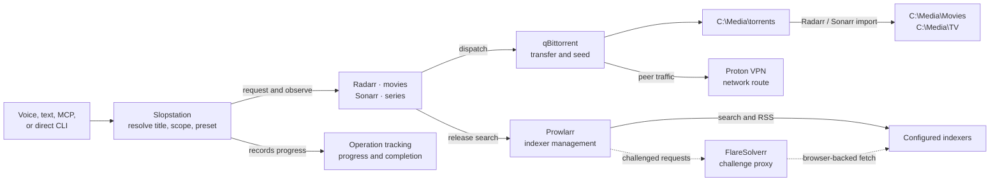

# Media acquisition on the K15

Slopstation converts a voice, text, MCP, or direct CLI request into durable
desired state in Radarr or Sonarr. Those services select releases, qBittorrent
transfers them, and Slopstation observes progress without owning the download
process.

## Architecture




Prowlarr, FlareSolverr, Radarr, and Sonarr run in Docker Compose. qBittorrent
and Proton VPN run natively on Windows.

| Component | Owns |
|---|---|
| Slopstation | Title resolution, explicit scope, preset selection, operation tracking, announcements |
| Prowlarr | Indexer definitions, categories, RSS/search modes, and per-indexer seed limits |
| Radarr | Movie monitoring, quality decisions, download dispatch, import, and cleanup |
| Sonarr | Series/season/episode monitoring, quality decisions, download dispatch, import, and cleanup |
| qBittorrent | Peer transfer, progress, seeding, and stop action |
| Proton VPN | qBittorrent’s peer-network route and forwarded port |
| FlareSolverr | Browser challenges for tagged Prowlarr indexers |

The Arr quality profiles own release policy. Slopstation selects a configured
profile name; it does not score release titles itself. Future monitored episodes
remain Sonarr desired state after the originating Slopstation operation ends.

## Storage and addresses

`Start-Media.ps1` maps one Windows media root to `/data` in Radarr and Sonarr.
The default is `C:\Media`; changing the host root later does not change the
container paths stored by Slopstation.

| Purpose | Value |
|---|---|
| qBittorrent download path | `C:\Media\torrents` |
| Radarr root | `/data/Movies` → `C:\Media\Movies` |
| Sonarr root | `/data/TV` → `C:\Media\TV` |
| Prowlarr UI | `http://127.0.0.1:9696` |
| Radarr UI | `http://127.0.0.1:7878` |
| Sonarr UI | `http://127.0.0.1:8989` |
| qBittorrent UI | `http://127.0.0.1:8080` |
| Internal FlareSolverr | `http://flaresolverr:8191` |

Use these URLs from the K15. Do not expose management ports to the internet.

## Bootstrap

### 1. Start the sidecars

Install Docker Desktop with Linux containers, then run from the repository
root:

```powershell
powershell -NoProfile -ExecutionPolicy Bypass -File .\k15\media\Start-Media.ps1
```

On first run the script copies `.env.example` to `.env`, creates the config and
media directories, and starts FlareSolverr, Prowlarr, Radarr, and Sonarr. Review
`.env` before moving the media root from `C:\Media`. Complete the first-run
authentication prompt in each local UI.

### 2. Configure native qBittorrent and Proton

Run qBittorrent as a native Windows application; do not add it to Compose.

- Proton: WireGuard, P2P server, include-only split tunnel containing
  `qbittorrent.exe`, standard kill switch, LAN access, and port forwarding.
- qBittorrent peer interface: Proton’s interface; optional IP set to all
  addresses; UPnP/NAT-PMP disabled.
- Web UI: port `8080`, authenticated, listening where Docker can reach it, with
  localhost and subnet authentication bypass disabled.
- Default save path: `C:\Media\torrents`.
- Categories: create `radarr` and `sonarr`.

Set `media.qbittorrentNetworkInterface` in `k15\config.json` to the exact
interface name qBittorrent reports.

### 3. Configure Prowlarr

Add the indexers you are authorized to use, then add both applications with
**Full Sync**:

| Application | Server URL |
|---|---|
| Radarr | `http://radarr:7878` |
| Sonarr | `http://sonarr:8989` |

Use each application’s API key from **Settings → General**. In the Prowlarr
sync profile, enable RSS, automatic search, and interactive search. Confirm
movie categories reach Radarr and TV categories reach Sonarr.

For an indexer that needs browser-challenge handling, add a FlareSolverr
indexer proxy at `http://flaresolverr:8191`, give it a tag, and apply the same
tag to that indexer. FlareSolverr is internal-only and cannot solve an
interactive CAPTCHA.

### 4. Configure Radarr and Sonarr

In both applications, enable Completed Download Handling and add native
qBittorrent at `host.docker.internal:8080` with its Web UI credentials.

| Application | Root | Category |
|---|---|---|
| Radarr | `/data/Movies` | `radarr` |
| Sonarr | `/data/TV` | `sonarr` |

Add this remote path mapping in each application:

| Host | Remote path | Local path |
|---|---|---|
| `host.docker.internal` | `C:\Media\torrents` | `/data/torrents` |

Test the root, download client, and remote mapping before continuing.

### 5. Create quality profiles

Create every distinct profile name referenced by `moviePresets` and
`seriesPresets` in `k15\config.json`. The example configuration maps movie
defaults to Blu-ray/HDR/lossless-audio policy and offers explicit `1080p` and
`2160p` steering; series presets provide the corresponding TV profiles.

| Preset | Movie profile | Series profile |
|---|---|---|
| `default` | `Slopstation Blu-ray HDR TrueHD` | `Slopstation Series` |
| `1080p` | `Slopstation 1080p` | `Slopstation Series 1080p` |
| `2160p` | `Slopstation Blu-ray HDR TrueHD` | `Slopstation Series 2160p` |

Profiles own allowed qualities, upgrades, cutoffs, custom-format scores, and
minimum scores. A strict profile waits when no qualifying release exists.

### 6. Enable Slopstation

Copy the Radarr and Sonarr API keys into `k15\secrets.json`. Maintenance and
port synchronization additionally use the Prowlarr key and qBittorrent Web UI
password:

```json
"radarrApiKey": "...",
"sonarrApiKey": "...",
"prowlarrApiKey": "...",
"qbittorrentPassword": "..."
```

Copy the `media` object from `config.example.json` into `config.json`, set its
URLs, roots, profile mappings, qBittorrent username/interface, and managed
indexers, then set `enabled` to `true`.

### 7. Validate and start unattended operation

From `k15\agent`:

```powershell
.venv\Scripts\python tools\media.py status
.venv\Scripts\python tools\media.py profiles
.venv\Scripts\python tools\media.py validate
.venv\Scripts\python tools\media.py doctor
```

`validate` checks roots and exact profile names. `doctor` additionally checks
containers, APIs, health, indexers, download clients, cleanup policy,
qBittorrent’s VPN binding, categories, Web UI security, and Proton port sync.
Neither command adds a torrent.

For unattended use, configure Docker Desktop, Proton, and native qBittorrent
to start at login. Compose services use `restart: unless-stopped`.

## Request lifecycle

For “download Always Sunny season 18 in 4K,” Slopstation resolves a TVDB ID,
requires explicit season scope, maps `2160p` to a Sonarr profile, and creates or
updates the monitored season. Sonarr searches immediately and later consumes
new releases through RSS. A qualifying release is sent to qBittorrent, imported
into `/data/TV`, and reported through the durable operation ledger.

Operation phases are `searching`, `waiting_for_match`, `downloading`,
`importing`, and `ready`. The 30-second reconciliation interval is a polling
cadence, not a timeout. If an authority is unavailable, the operation becomes
`UNKNOWN` and resumes when observation succeeds.

For a season containing future episodes, the operation can complete after all
currently aired episodes are ready. Sonarr continues monitoring future episodes
independently.

## Seeding and cleanup

The configured public-indexer policy is ratio `0.25` or 60 minutes, whichever
is reached first:

1. Prowlarr stores those values on each managed indexer and synchronizes them
   to Radarr and Sonarr.
2. qBittorrent uses matching global limits as a fallback and **stops** the
   torrent. It must never delete content itself.
3. Radarr or Sonarr imports the library file, waits for the torrent to stop,
   then removes the torrent and download payload when **Remove Completed
   Downloads** is enabled.

Keep the `radarr` and `sonarr` categories after import. Validate cleanup first
with a small movie and then a small episode: the imported library file must
remain after the torrent payload is removed.

## Proton forwarded-port synchronization

The Proton Windows client writes current port-forwarding state to:

```text
%LOCALAPPDATA%\Proton\Proton VPN\Logs\client-logs.txt
```

Slopstation accepts only a fresh active mapping from that log. Transitional,
stopped, stale, missing, or unrecognized state never changes qBittorrent.

Validate once:

```powershell
cd C:\Users\minipc\Desktop\slopstation\k15\agent
.venv\Scripts\python tools\media.py proton-port
.venv\Scripts\python tools\media.py sync-proton-port --execute
```

Confirm the returned port matches Proton and qBittorrent, then set
`media.protonPortSync` to `true` and reload with `Start-K15.bat`. The monitor
checks immediately and every `media.pollS` seconds. Log-format changes fail
closed and emit `proton_port_sync_failed`.

Manual fallback:

```powershell
.venv\Scripts\python tools\media.py set-qbit-port <active-port> --execute
```

## Monitoring and incident response

The voice supervisor polls Radarr and Sonarr health every five minutes by
default. It emits changes rather than repeating the same condition:

| Event | Meaning |
|---|---|
| `media_health_issue` / `media_health_cleared` | Arr health entry appeared or cleared |
| `media_import_failed` | Import was rejected or failed |
| `media_queue_stalled` | A download queue item is warning or error |
| `media_watch_failed` | An authority became unreachable |

Set `media.healthSync` to `false` to disable this watch or change
`media.healthPollS` to adjust its interval.

Start diagnosis with:

```powershell
.venv\Scripts\python tools\media.py doctor
.venv\Scripts\python tools\operations.py list --active
docker compose --project-directory ..\media --env-file ..\media\.env ps
```

Inspect **System → Status**, **Activity → Queue**, and **History** in the
relevant Arr application before changing configuration.

## Pinning the containers

All four images ride `:latest` until frozen. Freeze from the K15, from what is
running - upstream may already be ahead. Each app prints its own version at
System > Status on the setup pages above; FlareSolverr's is on its `/` page
and in `docker compose ps` output.

Write each version into `compose.yaml` in place of `latest` and commit. After
that, an upgrade is a deliberate tag edit plus `Start-Media.ps1`, not a side
effect of the next `docker compose pull`.

## Backup and restore

Everything the bootstrap sections above configure by hand - API keys, indexer
definitions, quality profiles, root folders, download-client entries - lives
only in the config databases under `MEDIA_CONFIG_ROOT`, one directory per
service. None of it is in this repo, and none of it survives a rebuilt config
volume (which is also why the health monitor polls instead of taking
webhooks: a notification connection would live in the same database).

`MEDIA_CONFIG_ROOT` lives in `k15\media\.env`, not the shell environment, so
read it the way `Start-Media.ps1` does. Back up while the stack is stopped, or
the SQLite files may copy mid-write. From the checkout root:

```
$cfg = @{}; Get-Content k15\media\.env | ForEach-Object { if ($_ -match '^\s*([^#=]+)=(.*)$') { $cfg[$Matches[1].Trim()] = $Matches[2].Trim() } }
docker compose --project-directory k15\media --env-file k15\media\.env stop
Copy-Item -Recurse $cfg.MEDIA_CONFIG_ROOT "$($cfg.MEDIA_CONFIG_ROOT)-backup"
.\k15\media\Start-Media.ps1
```

Restore is the reverse: stop, copy the backup over `MEDIA_CONFIG_ROOT`, start.
Native qBittorrent keeps its own config outside the stack at
`%APPDATA%\qBittorrent` and `%LOCALAPPDATA%\qBittorrent`; back those up with
it or the category/port setup re-does by hand.

## Moving the media root

To migrate from `C:\Media` to a NAS: stop Compose and qBittorrent, copy the
media root, change `MEDIA_ROOT` in `.env`, change qBittorrent’s save path and
both Arr remote path mappings, then restart and run `tools\media.py doctor`. Keep the
container roots `/data/Movies`, `/data/TV`, and `/data/torrents` unchanged.
